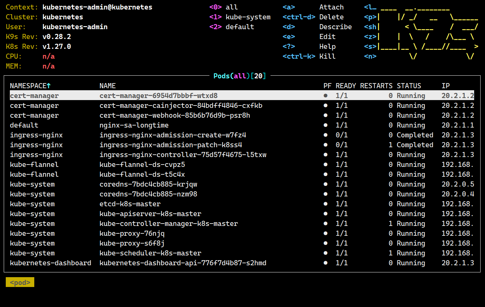

# Kubernetes 进阶教程

作为 [Kubernetes 基础教程](doc_tutorial.md) 的续篇，本文档将介绍一些进阶内容，包括在集群中使用存储、如何管理集群资源的使用以及集群资源的调度原理等主题。
每个章节之间没有严格的顺序依赖关系，读者可以选择感兴趣的章节进行阅读。

如果你在阅读本文时发现了任何错误，请在Github上提交ISSUE（或PR），我将由衷地表示感谢。

为了方便阅读，请点击网页右侧的  按钮在右侧展开目录以了解全文大纲。

**环境准备**：

```
10.0.2.2 k8s-master  
10.0.2.3 k8s-node1
```

一些提高效率的设置：

1. [安装ohmyzsh](doc_install_ohmyzsh.md)
2. 设置kubectl的alias为`kk`，下文会用到。

## 1. 存储与配置

如果你的应用需要使用存储功能，那么你需要先了解存储卷（Volume）的概念。k8s定义了下面几类存储卷（volume）抽象来实现相应功能：

1. 本地存储卷：用于Pod内多个容器间的存储共享，或这Pod与节点之间的存储共享；
2. 网络存储卷：用于多个Pod之间甚至是跨节点的存储共享；
3. 持久存储卷：基于网络存储卷，用户无须关心存储卷的创建所使用的存储系统，只需要自定义具体消费的资源额度（将Pod与具体存储系统解耦）；

所有的卷映射到容器都是以**目录或文件**的形式存在。

此外，这一节还会提到StatefulSet控制器，它用来管理有状态应用程序的部署。有状态应用程序通常是需要唯一标识、稳定网络标识和有序扩展的应用程序，
例如数据库、消息队列和存储集群。StatefulSet 为这些应用程序提供了一种在 Kubernetes 集群中管理和维护的方法。

### 1.1 本地存储卷

本地存储卷（LocalVolume）是Pod内多个容器间的共享存储，Pod与节点之间的共享存储。它主要包括`emptyDir`和`hostPath`两种方式，
这两种方式都会直接使用节点上的存储资源，区别在于`emptyDir`的存储卷在Pod的生命周期内存在，而`hostPath`的存储卷由节点进行管理。

#### 1.1.1 emptyDir

emptyDir是一个纯净的空目录，它占用节点的一个临时目录，在Pod重启或重新调度时，这个目录的数据会丢失。Pod内的容器都可以读写这个目录（也可以对容器设置只读）。
一般用于短暂的临时数据存储，如缓存或临时文件。

[pod_volume_emptydir.yaml](pod_volume_emptydir.yaml) 定义了有两个容器（write和read）的Pod，并且都使用了emptyDir定义的卷，
现在应用它并查看Pod内read容器的日志：

```shell
$ kk apply -f pod_volume_emptydir.yaml
pod/busybox created
$ kk get pod                           
NAME      READY   STATUS    RESTARTS   AGE
busybox   2/2     Running   0          2m8s
$ kk logs busybox read
hellok8s!
```

注意模板中先定义了write容器，所以它先启动且写入了数据，然后再启动read容器以至于能够读到数据。

Pod使用的emptyDir具体的位置在节点上的 `/var/lib/kubelet/pods/<pod-uid>/volumes/kubernetes.io~empty-dir`目录下找到：

```shell
# 在master节点查看 pod uid
$ kk get pod busybox  -o jsonpath='{.metadata.uid}'
b6abc3f2-d9b3-4297-b636-e33f06d0278d

# 在node1查看具体位置
[root@k8s-node1 ~]# ls /var/lib/kubelet/pods/b6abc3f2-d9b3-4297-b636-e33f06d0278d/volumes/
kubernetes.io~empty-dir  kubernetes.io~projected
[root@k8s-node1 ~]# ls /var/lib/kubelet/pods/b6abc3f2-d9b3-4297-b636-e33f06d0278d/volumes/kubernetes.io~empty-dir/
temp-dir
```

**使用内存作为emptyDir**  
k8s允许我们在定义emptyDir时使用内存作为实际存储卷，以提高临时卷的读写速度，但需要注意容器对内存的占用需求，避免超限或占用过高影响节点上其他Pod。
按下面的方式定义：

```yaml
volumes:
  - name: cache-volume
    emptyDir:
      medium: Memory
```

#### 1.1.2 hostPath

hostPath是节点上的一个**文件或目录**，Pod内的容器都可以读写这个卷，这个目录的生命周期与**节点**相同。需要注意的是，
Pod调度到其他节点就无法读取到之前它自己写入的数据。

[pod_volume_hostpath.yaml](pod_volume_hostpath.yaml) 定义了包含一个write容器的Pod，
并且使用hostPath定义了volume，映射节点的`/home/host-temp-dir`目录，现在应用它并在node1上查看容器写入的数据：

```shell
# 必须提前在node1上创建目录（当hostPath.type为空时）
[root@k8s-node1 ~]# mkdir /home/host-temp-dir

# 在master上启动Pod
$ kk apply -f pod_volume_hostpath.yaml
$ kk get pod                            
NAME               READY   STATUS    RESTARTS   AGE
busybox            2/2     Running   0          26m
busybox-hostpath   1/1     Running   0          11s

# 在node1上查看数据
[root@k8s-node1 ~]# cat /home/host-temp-dir/data 
hellok8s!
```

hostPath卷比较适用于DaemonSet控制器，运行在DaemonSet控制器中的Pod会常驻在各个节点上，一般是日志或监控类应用。

另外，hostPath允许定义`type`属性，以指定映射行为：

| 类型                | 描述                                                                              |
|-------------------|---------------------------------------------------------------------------------|
| 空字符串（默认）          | 用于向后兼容，这意味着在安装 hostPath 卷之前不会执行任何检查。                                            |
| DirectoryOrCreate | 如果在给定路径上什么都不存在，那么将根据需要创建空目录，权限设置为 0755，具有与 kubelet 相同的组和属主信息。**它可以自动创建中间目录**    |
| Directory         | 在给定路径上必须存在的目录。                                                                  |
| FileOrCreate      | 如果在给定路径上什么都不存在，那么将在那里根据需要创建空文件，权限设置为 0644，具有与 kubelet 相同的组和所有权。**它要求中间目录必须存在**！ |
| File              | 在给定路径上必须存在的文件。                                                                  |
| Socket            | 在给定路径上必须存在的 UNIX 套接字。                                                           |
| CharDevice        | 在给定路径上必须存在的字符设备。                                                                |
| BlockDevice       | 在给定路径上必须存在的块设备。                                                                 |

当使用hostPath卷时要小心，因为：

- HostPath 卷可能会暴露特权系统凭据（例如 Kubelet）或特权 API（例如容器运行时套接字），可用于容器逃逸或攻击集群的其他部分。
- 具有相同配置（例如基于同一 PodTemplate 创建）的多个 Pod 会由于节点上文件的不同而在不同节点上有不同的行为。
- 下层主机上创建的文件或目录只能由 root 用户写入。 你需要在特权容器中以 root 身份运行进程，或者修改主机上的文件权限以便容器能够写入
  hostPath 卷。

k8s官方建议避免使用 HostPath，当必须使用 HostPath 卷时，它的范围应仅限于所需的文件或目录，最好以**只读方式**挂载。

### 1.2 网络存储卷

一个典型的例子是NFS，熟悉网络的读者应该知道，NFS是网络文件系统，可以实现跨主机的数据存储和共享，k8s支持多种网络存储卷，
这其中包含众多云服务商提供的存储方案，比如NFS/iSCSI/GlusterFS/RDB/azureDisk/flocker/cephfs等，最新的支持细节在 [这里](https://kubernetes.io/zh-cn/docs/concepts/storage/volumes)
查看。

网络存储卷属于第三方存储系统，所以其生命周期也是与第三方绑定，不受Pod生命周期影响。

大部分网络存储卷是集成各种第三方的存储系统，所以配置上各有差别，这里不会一一说明。[pod_volume_nfs.yaml](pod_volume_nfs.yaml)
是一个使用NFS卷的Pod模板示例，可供参考。
你还可以查看 [更多NFS示例](https://github.com/kubernetes/examples/tree/master/staging/volumes/nfs)。

### 1.3 持久存储卷

上节说到，网络存储卷是集成第三方存储系统，所以具体卷配置参数一般是对应存储管理人员才会熟悉，且这些都不应该是开发人员和集群管理者需要关心的，
所以k8s引入了持久存储卷概念，持久存储卷是集群级别的资源，由集群管理员创建，然后由集群用户去使用。

具体来说，k8s提供三种基于存储的抽象概念：

- PV（Persistent Volume）
- StorageClass
- PVC（Persistent Volume Claim）

这三者用于支持基础设施和应用程序之间的分离，以便于开发人员和存储管理人员各司其职，由存储管理人员设置PV或StorageClass，
并在里面配置存储系统和参数，然后开发人员只需要创建PVC来申请指定空间的资源以存储和共享数据即可，无需关心底层存储系统细节。
当删除PVC时，它写入具体存储资源的数据可以根据回收策略自动清理。

#### 1.3.1  使用PV和PVC

PV表示持久存储卷，定义了集群中可使用的存储资源，其中包含存储资源的类型、回收策略、存储容量等参数。

PVC表示持久存储卷声明，是用户发起对存储资源的申请，用户可以设置申请的存储空间大小、访问模式。

[pod_use_pvc.yaml](pod_use_pvc.yaml) 提供了一个Pod使用PVC的完整示例（也可以将其分离为多个单独模板），其中按顺序定义了PV和PVC以及使用PVC的Pod。
下面是测试情况：

```shell
$ kk apply -f pod_use_pvc.yaml
persistentvolume/pv-hostpath created
persistentvolumeclaim/pvc-hostpath created
pod/busybox-use-pvc configured

$ kk get pv,pvc,pod
NAME                           CAPACITY   ACCESS MODES   RECLAIM POLICY   STATUS   CLAIM                  STORAGECLASS   REASON   AGE
persistentvolume/pv-hostpath   1Gi        RWX            Retain           Bound    default/pvc-hostpath   node-local              112s

NAME                                 STATUS   VOLUME        CAPACITY   ACCESS MODES   STORAGECLASS   AGE
persistentvolumeclaim/pvc-hostpath   Bound    pv-hostpath   1Gi        RWX            node-local     112s

NAME                   READY   STATUS    RESTARTS   AGE
pod/busybox            2/2     Running   0          5h31m
pod/busybox-hostpath   1/1     Running   0          4h38m
pod/busybox-use-pvc    1/1     Running   0          2m48s

# 在node1查看数据写入
[root@k8s-node1 ~]# cat /home/host-pv-dir/data 
hellok8s, pvc used!
```

这里可以看到，Pod使用PVC成功，并且数据已经写入到PVC对应的PV中。需要说明的是，`kk get pv`输出中的`STATUS：Bound`表示绑定存储资源成功，
这里表现为node1上已存在`/home/host-pv-dir`目录（会自动创建）。同理，`kk get pvc`输出中的`STATUS：Bound`表示申请资源成功（有足够的空间可用）。

PVC通过`storageClass`、`accessModes`和存储空间这几个属性来为PVC匹配符合条件的PV资源。具体来说，若要匹配成功，要求在PV和PVC中，
`storageClass`和`accessModes`属性必须一致，而且PVC的`storage`不能超过PV的`capacity`。

另外，这里需要说明一下上述输出中`ACCESS MODES`即访问模式属性，它们的含义如下：

- ReadWriteOnce（RWO）：允许**单个集群节点**以读写模式挂载一个PV
- ReadOnlyMany（ROX）：允许多个集群节点以只读模式挂载一个PV
- ReadWriteMany（RWX）：允许多个集群节点以读写模式挂载一个PV
- ReadWriteOncePod（RWOP，k8s v1.27 beta）：允许单个Pod以读写模式挂载一个PV

单个集群节点上可以运行多个Pod。这个属性值取决于你挂载的存储系统实际支持怎样的访问模式以及个性需求。

**当PVC申请的资源无法满足时**

```shell
# 修改pvc中的storage为大于pv中容量的数字，比如5000Gi
$ kk get pv,pvc,pod
NAME                           CAPACITY   ACCESS MODES   RECLAIM POLICY   STATUS      CLAIM   STORAGECLASS   REASON   AGE
persistentvolume/pv-hostpath   1Gi        RWX            Retain           Available           node-local              6s

NAME                                 STATUS    VOLUME   CAPACITY   ACCESS MODES   STORAGECLASS   AGE
persistentvolumeclaim/pvc-hostpath   Pending                                      node-local     6s

NAME                   READY   STATUS    RESTARTS   AGE
pod/busybox            2/2     Running   0          5h49m
pod/busybox-hostpath   1/1     Running   0          4h56m
pod/busybox-use-pvc    0/1     Pending   0          6s

$ kk describe pvc pvc-hostpath 
Name:          pvc-hostpath
Namespace:     default
StorageClass:  node-local
Status:        Pending
Volume:        
Labels:        <none>
Annotations:   <none>
Finalizers:    [kubernetes.io/pvc-protection]
Capacity:      
Access Modes:  
VolumeMode:    Filesystem
Used By:       busybox-use-pvc
Events:
  Type     Reason              Age   From                         Message
  ----     ------              ----  ----                         -------
  Warning  ProvisioningFailed  11s   persistentvolume-controller  storageclass.storage.k8s.io "node-local" not found
```

如上所示，当PVC申请的资源无法满足时，创建的pvc和pod都会处于Pending状态，且pvc到Events中会显示无法找到对应的storageclass。
然后我们再修改pv的容量为大于等于pvc申请的容量并apply，接着pvc和pod就会正常启动（无需干预）。

> 经笔者测试，pvc的容量不允许改小，但pv的容量却是可以改小的，且不会立即影响pvc和pod。请注意，这不是一个常规的操作！

#### 1.3.2 PV的解绑和回收

上一小节中已经创建了一个PVC关联到PV，那是否可以再创建一个PVC绑定到同个PV？单独定义[pvc_hostpath.yaml](pvc_hostpath.yaml)
进行验证：

```shell
$ kk apply -f pod-hostpath.yaml 
persistentvolumeclaim/pvc-hostpath-2 created

$ kk describe pvc pvc-hostpath-2
Name:          pvc-hostpath-2
Namespace:     default
StorageClass:  node-local
Status:        Pending
Volume:        
Labels:        <none>
Annotations:   <none>
Finalizers:    [kubernetes.io/pvc-protection]
Capacity:      
Access Modes:  
VolumeMode:    Filesystem
Used By:       <none>
Events:
  Type     Reason              Age   From                         Message
  ----     ------              ----  ----                         -------
  Warning  ProvisioningFailed  8s    persistentvolume-controller  storageclass.storage.k8s.io "node-local" not found
```

即使空间足够，一个PV也不能同时绑定多个PVC，可见PVC和PV是一对一绑定的，想要再次绑定到PV，只能删除PV已经绑定的PVC。

当PV没有被绑定PVC时的状态是`Available`，如果PVC的策略是`Retain`，在删除PVC后。PV的状态会变成`Released`
，若要再次绑定，只能重新创建。如果是`Delete`策略且删除成功，则PVC删除后，PV会直接变成`Available`。

若不想重新创建，也可以直接修改PV的信息（通过`kk edit pv pv-hostpath`删除`claimRef`部分信息）使其变成`Available`
。但建议的操作是清理PV资源后再重新创建。

#### 1.3.3 保护使用中的PV和PVC

k8s默认执行保守的删除策略，当用户想要删除PV或PVC时，k8s不会立即删除使用中的PV和PVC，强制删除也不可以，此时PV和PVC的状态是`Terminating`，
直到不再被使用。

```shell
$ kk delete pvc pvc-hostpath --force
Warning: Immediate deletion does not wait for confirmation that the running resource has been terminated. The resource may continue to run on the cluster indefinitely.
persistentvolumeclaim "pvc-hostpath" force deleted

$ kk get pv,pvc,pod                 
NAME                           CAPACITY   ACCESS MODES   RECLAIM POLICY   STATUS   CLAIM                  STORAGECLASS   REASON   AGE
persistentvolume/pv-hostpath   1Ti        RWX            Retain           Bound    default/pvc-hostpath   node-local              21m

NAME                                 STATUS        VOLUME        CAPACITY   ACCESS MODES   STORAGECLASS   AGE
persistentvolumeclaim/pvc-hostpath   Terminating   pv-hostpath   1Ti        RWX            node-local     70s

NAME                   READY   STATUS    RESTARTS   AGE
pod/busybox            2/2     Running   0          6h39m
pod/busybox-hostpath   1/1     Running   0          5h46m
pod/busybox-use-pvc    1/1     Running   0          70s
```

**Finalizers**  
我们可以通过describe查看pvc的信息中包含一行信息：`Finalizers:    [kubernetes.io/pvc-protection]`，Finalizers 是一种
Kubernetes 对象的属性，
用于定义在删除对象时要执行的清理操作。在 PV 对象中，kubernetes.io/pv-protection 是一个 Finalizer，它指示 PV 正在受到保护，防止被删除。
当管理员或用户尝试删除PV或PVC时，Finalizer 会阻止删除操作，直到所有的资源已经释放或者相应的清理操作完成。

这个机制的目的是确保数据的安全性，避免因意外删除而导致数据丢失。

#### 1.3.4 预留PV

有些时候，我们在创建PV时希望将其预留给指定的PVC（可能尚未创建），以便在需要时可以快速创建PVC并绑定到PV上。这主要通过模板中的`claimRef`
字段来实现：

```yaml
apiVersion: v1
kind: PersistentVolume
metadata:
  name: foo-pv
spec:
  storageClassName: ""
  claimRef:
    name: foo-pvc # 预留pvc的名称
    namespace: foo
...
```

#### 1.3.5 关于PV和PVC的注意事项

- PV与PVC的绑定需要匹配多个属性值，即存储类名、存储大小、访问模式。
- PV允许被不同namespace中的PVC绑定。
- PV和PVC只能一对一绑定，但一个PVC可以被多个Pod同时使用。由于这一点，PVC的`storage`属性通常设置为和PV一致，不然会造成空间浪费。
- PVC的容量不能缩小，但PV可以，虽然不建议这样做。
- hostPath类型的PV资源一般只用于开发和测试环境，其目的是使用节点上的文件或目录来模拟网络附加存储。在生产集群中，你不会使用
  hostPath。 集群管理员会提供网络存储资源，比如 Google Compute Engine 持久盘卷、NFS 共享卷或 Amazon Elastic Block Store 卷。
- k8s通过一个插件层来连接各种第三方存储系统，这个插件层核心是一套接口叫CSI（Container Storage
  Interface），存储提供商可以自行实现这个接口来对接k8s。

#### 1.3.6 使用StorageClass

前面讲的PV是一种静态创建卷的方式，也就是说，在创建PVC时必须指定一个已经存在的PV。这样的操作步骤在大规模集群中是非常繁琐的，因为需要管理员手动创建和配置PV。

假设你有一个空间较大的存储系统，想要分给多个（可能几十上百个）不同k8s应用使用（每个应用独立使用一段空间），这时候按之前方式就需要手动创建与应用数量一致的PV，
这个工作量是非常大的，以后维护也很麻烦。但如果使用StorageClass，就可以通过**动态方式**创建PV，然后自动绑定到PVC上。

使用StorageClass，管理员可以对接多个存储后端，每个存储后端都可以有不同的配置。比如现有一块高速存储容量1TB，一块标准存储500GB，
就可以定义两个StorageClass，分别叫做`sc-fast-1T`和`sc-std-500G`（k8s中使用`sc`代指StorageClass），然后直接可以创建PVC去绑定其中一个存储类，
绑定成功就会自动创建一个目标大小的PV（并绑定PVC），这个PV由存储类进行自动管理。

**定义StorageClass**  
每个 StorageClass 都包含 `provisioner`、`parameters` 和 `reclaimPolicy` 字段， 这些字段会在 StorageClass 需要动态制备 PV
时会使用到。

每个 StorageClass 都有一个制备器（Provisioner），用来决定使用哪个卷插件制备 PV。 该字段必须指定。
不同的存储后端（如 AWS EBS、GCE PD、Azure Disk 等）都有不同的卷插件，因此需要根据所使用的存储后端指定对应的制备器，以及配置相应的参数。
比如使用NFS作为的存储后端的存储类定义是：

```yaml
apiVersion: storage.k8s.io/v1
kind: StorageClass
metadata:
  name: example-nfs
provisioner: example.com/external-nfs
parameters:
  server: nfs-server.example.com
  path: /share
  readOnly: "false"
```

而使用AWS EBS作为存储后端的存储类定义是：

```yaml
apiVersion: storage.k8s.io/v1
kind: StorageClass
metadata:
  name: slow
provisioner: kubernetes.io/aws-ebs
parameters:
  type: io1
  iopsPerGB: "10"
  fsType: ext4
```

可以看到`provisioner`是不同的，而`parameters`更是大相径庭。不过，配置和管理StorageClass的工作是交给专门的运维人员来完成，开发人员不需要清楚其中细节。

[pod_use_storageclass.yaml](pod_use_storageclass.yaml) 是一个使用 StorageClass 的完整模板定义。需要特别说明的是，
这是一个使用hostpath作为存储后端的示例，k8s要求当使用hostpath作为存储后端时，必须手动创建PV来作为一个StorageClass的持久卷，这是一个特例，
使用第三方存储后端时不需要。

使用 StorageClass 的时候，每个Pod使用的空间由 StorageClass 进行管理，它会在存储后端中为每个Pod划分一个单独的空间（目录）。
> 注意：使用hostpath作为存储后端是一个特例，它不会为节点上的每个Pod划分单独的目录，而是共享同一个目录。

使用第三方存储后端时如何填写 StorageClass 的`parameters`
参考[官方文档](https://kubernetes.io/zh-cn/docs/concepts/storage/storage-classes/#parameters) 。

**设置默认的StorageClass**  
可以在集群上启用动态卷制备，以便在未指定存储类的情况下动态设置所有PVC。具体步骤参考[官方文档](https://kubernetes.io/zh-cn/docs/concepts/storage/dynamic-provisioning/#defaulting-behavior) 。

> 开始下一节之前，请先删除本节创建的资源：`kk delete -f pod_use_storageclass.yaml`

## 2. 使用StatefulSet

StatefulSet 是与ReplicaSet同级的一种 **有状态**
控制器，与无状态部署的ReplicaSet控制器不同的是，StatefulSet可以保证Pod的顺序和唯一性。当有与部署顺序、持久数据或固定网络等有关等特殊应用需求时，
可以上使用 StatefulSet 来部署应用。它可以提供的功能特性如下：

- 有序性：严格按照定义的顺序部署和扩展Pod，每个 Pod 都有一个唯一的索引，从 0 开始；
- 稳定的网络标识符：Pod重新调度后其PodName和Hostname不变，这基于无头Service实现；
- 持久性存储：StatefulSet 通常与 PersistentVolumeClaim (PVC) 配合使用，以提供持久性存储。每个 Pod 可以绑定到一个独立的
  PVC，以确保数据在 Pod 重新调度或故障恢复时不会丢失；

StatefulSet 控制器由3个部分组成：

- 无头Service：用于为Pod资源标识符生成可解析的DNS记录；
- volumeClaimTemplate：基于静态或动态PV供给方式为Pod提供独立的固定存储卷；
- StatefulSet：用于控制Pod的创建和销毁。

考虑这样一种场景，我们需要在集群中部署3个mysql实例，由于是数据库服务，每个实例都需要一个独立的存储空间，而且它们保存的数据各不相同，
就不能相互替代，如果使用（由Deployment管理的）ReplicaSet部署，Pod在重建后，volume虽然没有删除，但没有一种机制让新的Pod实例继续使用之前的volume提供服务，而且重建后的Pod名称也是随机的，
客户端无法知晓新的Pod实例名以读取之前的数据。而使用 StatefulSet 部署就可以提供所需要这些功能。

此外，StatefulSet控制器可以在其模板中配置`volumeClaimTemplate`来为Pod提供存储卷，不需要专门定义PVC。

### 2.1 开始测试

[stateful-svc.yaml](stateful-svc.yaml)
是一个完整的示例，下面是具体的测试步骤（在开始前，为了让Pod调度到master，请先执行 [删除master污点](https://www.cnblogs.com/zouhong/p/17351418.html)）：

```yaml
$ kk apply -f stateful-svc.yaml
service/stateful-svc created
statefulset.apps/statefulset created
storageclass.storage.k8s.io/sc-hostpath created
persistentvolume/pv-hostpath-0 created
persistentvolume/pv-hostpath-1 created

  # sts是statefulset的缩写
$ kk get svc,sc,pv,pvc,pod,sts -o wide
NAME                   TYPE        CLUSTER-IP   EXTERNAL-IP   PORT(S)    AGE     SELECTOR
service/kubernetes     ClusterIP   20.1.0.1     <none>        443/TCP    44h     <none>
service/stateful-svc   ClusterIP   None         <none>        8080/TCP   2m24s   app=stateful

NAME                                      PROVISIONER                    RECLAIMPOLICY   VOLUMEBINDINGMODE      ALLOWVOLUMEEXPANSION   AGE
storageclass.storage.k8s.io/sc-hostpath   kubernetes.io/no-provisioner   Delete          WaitForFirstConsumer   false                  2m24s

NAME                             CAPACITY   ACCESS MODES   RECLAIM POLICY   STATUS   CLAIM                                 STORAGECLASS   REASON   AGE     VOLUMEMODE
persistentvolume/pv-hostpath-0   500Gi      RWX            Retain           Bound    default/stateful-data-statefulset-0   sc-hostpath             2m24s   Filesystem
persistentvolume/pv-hostpath-1   500Gi      RWX            Retain           Bound    default/stateful-data-statefulset-1   sc-hostpath             2m24s   Filesystem

NAME                                                STATUS   VOLUME          CAPACITY   ACCESS MODES   STORAGECLASS   AGE    VOLUMEMODE
persistentvolumeclaim/stateful-data-statefulset-0   Bound    pv-hostpath-0   500Gi      RWX            sc-hostpath    103s   Filesystem
persistentvolumeclaim/stateful-data-statefulset-1   Bound    pv-hostpath-1   500Gi      RWX            sc-hostpath    101s   Filesystem

NAME                READY   STATUS    RESTARTS            AGE    IP             NODE         NOMINATED NODE   READINESS GATES
pod/statefulset-0   1/1     Running   0                   103s   20.2.36.83     k8s-node1    <none>           <none>
pod/statefulset-1   1/1     Running   0                   4s     20.2.235.196   k8s-master   <none>           <none>

NAME                           READY   AGE     CONTAINERS            IMAGES
statefulset.apps/statefulset   2/2     2m24s   python-svc-stateful   python:4.7
```

观察测试结果，可以看到：

- 稳定的网络ID：StatefulSet 中的每个 Pod 根据 StatefulSet 的名称和 Pod 的序号派生出它的主机名。
  组合主机名的格式为`$(StatefulSet 名称)-$(序号)`
- Pod是按0开始的序号逐个启动，且要求前一个`Running`后才会启动下一个
- StatefulSet为每个Pod自动创建了PVC资源
- 名为`statefulset`的StatefulSet已经部署到集群中的两个节点且正常运行（删除污点后可以允许Pod调度到Master）

> 在示例模板中存在关于PV资源的定义，在前一小节中已经讲到，这是在为了方便演示使用hostpath作为存储后端而导致必须手动创建PV，在使用其他第三方存储系统时不需要手动创建PV。

现在我们开始进一步验证：

```shell
# 在master执行
[root@k8s-master ~]# cat /home/host-sts-pv-dir/data             
This host is statefulset-1!

# 在node1上执行
[root@k8s-node1 ~]# cat /home/host-sts-pv-dir/data 
This host is statefulset-0!

# 在master启动cURL Pod，访问无头Service
$ kk apply -f pod_cURL.yaml           
pod/cURL created

$ kk exec -it cURL --  sh     
/ # nslookup stateful-svc
nslookup: can't resolve '(null)': Name does not resolve

Name:      stateful-svc
Address 1: 20.2.235.201 statefulset-1.stateful-svc.default.svc.cluster.local
Address 2: 20.2.36.84 statefulset-0.stateful-svc.default.svc.cluster.local

/ # cURL statefulset-0.stateful-svc.default.svc.cluster.local
<p> The host is statefulset-0</p>
/ # cURL statefulset-1.stateful-svc.default.svc.cluster.local
<p> The host is statefulset-1</p>
```

这里，我们验证了两个 StatefulSet Pod对节点本地卷的写入，然后部署一个cURL容器来查询部署的 StatefulSet无头服务的DNS信息，
得到了两个由`$(StatefulSet 名称)-$(序号)`组成的稳定虚拟ID（statefulset-1和statefulset-0），
并且通过cURL访问了两个Pod的本地服务，得到了预期结果。客户端可以在**集群内**使用这个虚拟ID来访问服务。
当然，也可以使用无头服务的总域名`statefulset-svc.default.svc.cluster.local`来访问，但这样访问的服务是随机的，当我们使用
StatefulSet 部署应用时，说明我们有需要**指定实例ID**进行访问的需求，否则使用Deployment就足够了。

**Pod的重建**  
StatefulSet会确保Pod重建后，Pod使用的存储卷保持不变，以保证Pod重建后仍然能够访问同一份数据。下面通过手动删除Pod模拟故障进行验证：

```shell
$ kk delete pod statefulset-0        
pod "statefulset-0" deleted

# 稍等几秒 Pod 进行重建，由于之前 0号Pod是在node1上允许的，所以在node1上查看重建时写入的数据                                                                                                                                                                               
[root@k8s-node1 ~]# cat /home/host-sts-pv-dir/data                                
This host is statefulset-0!
This host is statefulset-0!
```

可以看到，Pod重建后仍然能够在之前的节点写入相同的数据。虽然这里使用hostpath作为存储后端来验证这个功能不太严谨（因为Pod-1占用了另一个节点的本地卷，所以0号Pod一定会在原来的节点重建），
但StatefulSet控制器确实拥有这个功能，读者可以使用其他存储系统（如NFS）进行验证。

### 2.2 伸缩与更新

和Deployment一样，StatefulSet也支持动态伸缩，当StatefulSet的Replicas数量发生变化时（或直接通过`kubectl scale`
指令），StatefulSet控制器会确保Pod数量最终符合预期。
但不同的是，StatefulSet执行的是有序伸缩，具体来说是在扩容时从编号较小的开始逐个创建，而缩容时则是倒序进行。

StatefulSet有两种更新策略，可以通过`.spec.updateStrategy`字段进行控制。

- **OnDelete**：当 `.spec.updateStrategy.type` 设置为 OnDelete 时， 它的控制器将不会自动更新 StatefulSet 中的 Pod。
  用户必须手动删除
  Pod 以便让控制器创建新的 Pod；
- **RollingUpdate**：当 `.spec.updateStrategy.type` 设置为 RollingUpdate 时，对 StatefulSet 中的 Pod 执行自动的滚动更新。这是默认的更新策略。
    - 这种情况下，StatefulSet 控制器会从Pod序号大到小的顺序进行逐个更新（当Pod进入`Running`时再更新下一个）；
    - 分区滚动更新：通过声明 `.spec.updateStrategy.rollingUpdate.partition` 的方式，RollingUpdate 更新策略可以实现分区。
        - 比如，当 partition 设置为 1 时，StatefulSet 控制器只会更新序号大于等于 1 的
          Pod（如果大于replicas，则不会更新任何Pod）。当你需要进行分阶段（金丝雀）更新时才会用到这个参数。

### 2.3 PVC的保留

默认情况下，当Pod被删除时，StatefulSet控制器不会删除这个Pod使用的PVC。在 k8s
v1.27版本中，可以[进行配置](https://kubernetes.io/zh-cn/docs/concepts/workloads/controllers/statefulset/#persistentvolumeclaim-retention)。

## 3. 管理集群资源的使用

在k8s集群中，资源分为以下几种：

- 计算资源：如CPU、内存、存储、网络等物理资源，也包含节点本身；
- 资源对象：如Pod、Service、Deployment等抽象资源；
- 外部引用资源：如在使用PV/PVC时，实际上使用的是第三方存储资源，它们归类为外部引用资源。

在一个节点达到几十上百的大规模k8s集群中，资源数量也会达到一个不易维护的量级，此时集群会由多个管理人员甚至是不同团队共同维护，
在这种情况下，如何管控k8s资源的使用，就显得尤为重要。

k8s提供了多种资源管理方式，如：

- 资源配额（ResourceQuota）：对集群中所有资源进行统一管理，如CPU、内存、存储等；
- 命名空间（Namespace）：将集群中的资源进行逻辑隔离，如不同团队使用不同的命名空间。然后就可以管理整个命名空间的整体资源使用和单个资源使用规则；
- 标签、选择器和注解：在命名空间下，使用标签、选择器和注解，可以进一步对资源进行管理
    - 标签（labels）：可以用来标识资源身份，如标识Pod的镜像、环境、应用分类等
    - 选择器（selector）：高层资源（如Deployment）可以通过选择器关联低层资源（如Pod）
    - 注解（annotations）：类似标签，但它更灵活，可以存储结构化数据。一般用于向对象添加元数据，实现对对象行为的进一步控制。

### 3.1 控制Pod对计算资源的消耗

容器运行时通常会提供一些机制来限制容器能够使用的资源大小，如果容器超额使用了资源，则容器会被终止。例如在Docker中，
通过`docker run`命令中的`--cpu-shares/--cpu-quota/--memory`等参数进行资源限额控制。

同样的，k8s的Pod模板也提供这个功能，
[pod_limitResource.yaml](pod_limitResource.yaml) 是一个完整的示例（其中包含字段解释），下面是测试情况：

```shell
$ kk apply -f pod_limitResource.yaml       
pod/test-limit-resource created

$ kk get pod                         
NAME                      READY   STATUS    RESTARTS         AGE
test-limit-resource       1/1     Running   0                10s

# 等候20s 观察到Pod由于内存使用超额被终止
$ kk get pod
NAME                      READY   STATUS      RESTARTS         AGE
test-limit-resource       0/1     OOMKilled   0                35s

# 再等候几秒，观察到无法再次启动
$ kk get pod                           
NAME                  READY   STATUS             RESTARTS        AGE
test-limit-resource   0/1     CrashLoopBackOff   3 (6d17h ago)   2m32s
```

如果模板中`requests`部分的配额直接超过集群最大单节点可分配额度，则Pod将无法启动（处于Pending状态），因为节点上没有足够的资源来满足Pod的资源请求。

### 3.2 使用命名空间管理资源

k8s中，命名空间（namespace）是k8s中一种逻辑分组资源，可以用来对k8s集群中的资源进行隔离。在使用k8s的用户增多以后，这个功能会十分有用。

命名空间可以通过命令来创建：

```shell
# namespace的缩写是ns
$ kk create namespace test-namespace
namespace/test-namespace created
```

也可以通过模板创建：

```shell
apiVersion: v1
kind: Namespace
metadata:
  name: test-namespace2
```

查看所有命名空间：

```shell
$ kk get namespace
NAME              STATUS   AGE
default           Active   12d  # 所有未指定namespace属性的对象会分配到这里
kube-node-lease   Active   12d  # 存放各节点的Lease对象，用于节点的心跳检测
kube-public       Active   12d  # 此空间下的所有资源可以被所有人访问
kube-system       Active   12d  # 存放集群内建资源
test-namespace    Active   5m
test-namespace2   Active   86s
```

上面解释了集群创建之初就存在的命名空间用途。

在有了命名空间后，创建**大部分资源**时都可以指定namespace属性，这样资源就会分配到对应的命名空间下。比如常见的Pod：

```yaml
apiVersion: v1
kind: Pod
metadata:
  name: go-http
  namespace: test-namespace
...
```

其他资源都是类似的方式。然后可以通过在kubectl命令（如get/describe/logs/delete等）后加`-n或--namespace`参数查询指定空间下的资源，
不指定就是查询默认空间下的资源。

**少部分不在命名空间中的资源**  
比如命名空间资源本身，还有低级别资源如节点/持久存储卷等都不在命名空间中。通过下面命令可以查看存在命名空间中的资源：

```yaml
$ kk api-resources --namespaced=true
NAME                        SHORTNAMES   APIVERSION                     NAMESPACED   KIND
bindings                                 v1                             true         Binding
configmaps                  cm           v1                             true         ConfigMap
endpoints                   ep           v1                             true         Endpoints
events                      ev           v1                             true         Event
limitranges                 limits       v1                             true         LimitRange
persistentvolumeclaims      pvc          v1                             true         PersistentVolumeClaim
pods                        po           v1                             true         Pod
podtemplates                             v1                             true         PodTemplate
replicationcontrollers      rc           v1                             true         ReplicationController
resourcequotas              quota        v1                             true         ResourceQuota
secrets                                  v1                             true         Secret
serviceaccounts             sa           v1                             true         ServiceAccount
services                    svc          v1                             true         Service
controllerrevisions                      apps/v1                        true         ControllerRevision
daemonsets                  ds           apps/v1                        true         DaemonSet
deployments                 deploy       apps/v1                        true         Deployment
replicasets                 rs           apps/v1                        true         ReplicaSet
statefulsets                sts          apps/v1                        true         StatefulSet
localsubjectaccessreviews                authorization.k8s.io/v1        true         LocalSubjectAccessReview
horizontalpodautoscalers    hpa          autoscaling/v2                 true         HorizontalPodAutoscaler
cronjobs                    cj           batch/v1                       true         CronJob
jobs                                     batch/v1                       true         Job
leases                                   coordination.k8s.io/v1         true         Lease
networkpolicies                          crd.projectcalico.org/v1       true         NetworkPolicy
networksets                              crd.projectcalico.org/v1       true         NetworkSet
endpointslices                           discovery.k8s.io/v1            true         EndpointSlice
events                      ev           events.k8s.io/v1               true         Event
ingresses                   ing          networking.k8s.io/v1           true         Ingress
networkpolicies             netpol       networking.k8s.io/v1           true         NetworkPolicy
poddisruptionbudgets        pdb          policy/v1                      true         PodDisruptionBudget
rolebindings                             rbac.authorization.k8s.io/v1   true         RoleBinding
roles                                    rbac.authorization.k8s.io/v1   true         Role
csistoragecapacities                     storage.k8s.io/v1              true         CSIStorageCapacity
```

使用参数`--namespaced=false`可以查看不在命名空间中的资源。

**命名空间与集群DNS的关系**

命名空间是集群资源的逻辑分组，集群DNS是负责集群**命名空间**范围中的服务发现。在 [Kubernetes 基础教程](doc_tutorial.md)
中提到了Service的DNS，
其具体访问方式为`<service-name>.<namespace-name>.svc.<cluster-domain>`，其中就包含了命名空间的名称。

**删除命名空间**  
这是一个比较危险的操作，因为删除一个命名空间会连带删除其作用域下所有的资源对象，包括Pod、Service、RC等。
建议在删除前先确认命名空间下没有需要保留的资源对象，否则可能会误删。删除命令如下：

```shell
kk delete namespace <namespace-name>
```

#### 3.2.1 配置整体资源配额

在本节开头讲过，k8s可以针对整个命名空间进行资源配额限制，这个功能可以避免某个命名空间中滥用集群资源进而影响整个集群。
当然，也支持针对命名空间中单个资源对象的资源配额限制。

k8s通过`ResourceQuota`资源对象来管理命名空间中各类资源的配额，一个命名空间下允许配置多个`ResourceQuota`资源对象。
资源配额分为3种类型：

- 计算资源配额：如总CPU或内存等
- 存储资源配额：如PVC总数等
- 对象数量配额：如Pod或Service总数等

资源配额的工作方式如下：

- 不同的团队可以在不同的命名空间下工作。这可以通过 RBAC 强制执行。
- 集群管理员可以为每个命名空间创建一个或多个 ResourceQuota 对象。
- 当用户在命名空间下创建资源（如 Pod、Service 等）时，Kubernetes 的配额系统会跟踪集群的资源使用情况， 以确保使用的资源用量不超过
  ResourceQuota 中定义的硬性资源限额。
- 如果资源创建或者更新请求违反了配额约束，那么该请求会报错（HTTP 403 FORBIDDEN）， 并在消息中给出有可能违反的约束。
- 如果命名空间下的计算资源 （如 cpu 和 memory）的配额被启用， 则用户必须为这些资源设定请求值（request）和约束值（limit），否则配额系统将拒绝
  Pod 的创建。 （但可使用 `LimitRanger` 准入控制器来为没有设置计算资源需求的 Pod 设置默认值，后面会讲到）

在集群容量小于各命名空间配额总和的情况下，可能存在资源竞争。资源竞争时，Kubernetes 系统会遵循先到先得的原则。
不管是资源竞争还是配额的修改，都不会影响已经创建的资源使用对象。

[resource-quota.yaml](resource-quota.yaml) 是一个较为完整的示例，下面是测试情况:

```shell
$ kk apply -f resource-quota.yaml
  resourcequota/quota-default created

# 查看空间下的资源配额，可以看到创建的 quota-default 对象配置
$ kk describe namespace default
Name:         default
Labels:       kubernetes.io/metadata.name=default
Annotations:  <none>
Status:       Active

  Resource Quotas
Name:                   quota-default
  Resource                Used   Hard
  --------                ---    ---
  configmaps              2      10
  cpu                     50m    10
  limits.cpu              100m   10
  limits.memory           100Mi  1Gi
  memory                  50Mi   500Mi
  persistentvolumeclaims  0      10
  pods                    1      50
  replicationcontrollers  0      20
  requests.cpu            50m    10
  requests.memory         50Mi   500Mi
  requests.storage        0      10Gi
  resourcequotas          1      5
  secrets                 2      10
  services                1      10
  services.loadbalancers  0      5
  services.nodeports      0      5

  No LimitRange resource.
```

#### 3.2.2 配额作用域

每个配额都有一组相关的 scope（作用域），配额只会对作用域内的资源生效。 配额机制仅统计所列举的作用域的交集中的资源用量。
当一个作用域被添加到配额中后，它会对作用域相关的资源数量作限制。下面是支持的作用域详情：

| 作用域            | 描述                                           |
|----------------|----------------------------------------------|
| Terminating    | 匹配所有 spec.activeDeadlineSeconds 不小于 0 的 Pod。 |
| NotTerminating | 匹配所有 spec.activeDeadlineSeconds 是 nil 的 Pod。 |
| BestEffort     | 匹配所有 QoS 是 BestEffort 的 Pod。                 |
| NotBestEffort  | 匹配所有 QoS 不是 BestEffort 的 Pod。                |
| PriorityClass  | 匹配所有引用了所指定的优先级类的 Pods。                       |

关于每个作用域支持的资源类型，请参考 [配额作用域-官方文档](https://kubernetes.io/zh-cn/docs/concepts/policy/resource-quotas/#quota-scopes)。

如配额中指定了允许（作用域）集合之外的资源，会导致验证错误。下面提供两个模板示例，演示了作用域的配置方式。

- [resource-quota-scope.yaml](resource-quota-scope.yaml)：正确的配置
- [resource-quota-scope-invalid.yaml](resource-quota-scope-invalid.yaml)：无效的配置

关于作用域还有一些限制需要注意，比如`Terminating`和`NotTerminating`不能同时出现在一个命名空间中的同一个资源配额对象中，因为它们是互斥的；
同理，`BestEffort`和`NotBestEffort`也是互斥的。

#### 3.2.3 配置个体资源配额

前面讲了如何限制命名空间下的总资源配额限制，但很多时候，我们需要对单个资源进行配额限制，否则会出现单个Pod或容器过多占用资源的情况，从而影响命名空间下其他Pod。

k8s通过`LimitRange`来实现对单个资源对象的配额限制。具体支持以下功能：

- 设置单个Pod或容器的最小和最大计算资源用量
- 设置单个PVC的最小和最大存储用量
- 设置请求资源和上限资源的用量比例
- 设置命名空间下**默认**的计算资源请求和上线，并在运行时自动注入容器

在前面**资源配额的工作方式**处我们提到，如果命名空间下的计算资源 （如 cpu 和 memory）的配额被启用，
则用户必须为这些资源设定请求值（request）和约束值（limit），否则配额系统将拒绝
Pod 的创建（之前创建的Pod不受影响）。但如果每个Pod都手动设置未免有些麻烦，所以使用`LimitRange`可以减少一部分工作量。

这里提供以下模板示例供读者参考：

- [limitrange-for-container.yaml](limitrange-for-container.yaml)：限制单个容器的计算资源用量
- [limitrange-for-pod.yaml](limitrange-for-pod.yaml)：限制单个Pod的计算资源用量
- [limitrange-for-pvc.yaml](limitrange-for-pvc.yaml)：限制单个PVC的存储需求量

查询LimitRange配置：

```shell
$ kk describe limits  # limits是limitrange的缩写
Name:       limitrange-for-container
Namespace:  default
Type        Resource  Min    Max    Default Request  Default Limit  Max Limit/Request Ratio
----        --------  ---    ---    ---------------  -------------  -----------------------
Container   cpu       100m   200m   100m             150m           2
Container   memory    100Mi  300Mi  100Mi            200Mi          2


Name:       limitrange-for-pod
Namespace:  default
Type        Resource  Min    Max    Default Request  Default Limit  Max Limit/Request Ratio
----        --------  ---    ---    ---------------  -------------  -----------------------
Pod         memory    100Mi  300Mi  -                -              1
Pod         cpu       100m   200m   -                -              1


Name:                  limitrange-for-pvc
Namespace:             default
Type                   Resource  Min    Max  Default Request  Default Limit  Max Limit/Request Ratio
----                   --------  ---    ---  ---------------  -------------  -----------------------
PersistentVolumeClaim  storage   100Mi  1Gi  -                -              -
```

当再次（于这个命名空间中）创建Pod或PVC时，配置的资源必须符合配额限制，否则无法创建。

### 3.3 标签、选择器和注解

前面讲的命名空间是用来实现多租户的资源隔离的。在同一个命名空间下，还可以进一步实现资源的划分，对各个资源的身份进行标识。
这里主要用到的是下面三种方法：

- 标签：是用于标识和组织资源的键值对。它们可以附加到各种Kubernetes对象（如Pod、Service、Node等），用于对它们进行分类和过滤；
- 选择器：是用于按照标签进行筛选和选择资源的机制。在Pod或其他对象的定义中指定标签选择器，可以将特定标签的资源组合在一起；
- 注解： 注解是Kubernetes对象上的键值对，用于存储与对象相关的任意非标识性信息。相对于标签，注解更适合存储元数据信息、文档、或其他与对象关联的描述性信息。

#### 3.3.1 标签

标签（Labels） 在 Kubernetes 中是一种关键的元数据，用于标识和组织各种资源。与名称和 UID 不同，
标签没有唯一性限制，允许多个资源携带相同的标签键值对。以下是标签的一些关键特性和用途：

- **灵活性**： 标签是键值对的形式，键和值都是用户定义的，因此它们非常灵活。这使得用户可以根据自己的需求为资源添加任意数量和类型的标签。
- **资源分类**： 通过使用标签，用户可以轻松地对资源进行分类。例如，一个标签可以是"env: prod"，另一个可以是"app: WebServer"
  。这使得在庞大的集群中更容易找到和管理相关资源。
- **资源选择**： 标签的一个主要用途是通过选择器（selectors）筛选资源。选择器允许用户根据标签的键值对来选择一组匹配的资源。这在定义服务、控制器以及其他需要特定资源的地方非常有用。
- **多维度标识**： 标签支持多维度标识，因此可以同时使用多个标签来描述资源。这样，用户可以根据多个标签的组合来精确地选择特定的资源，从而更细粒度地管理它们。
- **动态更新**： 标签是可以动态更新的，这意味着用户可以根据资源的状态或其他变化来修改标签。这使得在不停机的情况下对资源进行动态调整和管理成为可能。

总体而言，标签为 Kubernetes 提供了一种强大的机制，用于组织、分类和选择资源。通过充分利用标签，用户可以更灵活地管理其容器化应用程序和整个集群。

对于每一种资源对象，都可以设置标签。方法是在模板的`metadata`中使用`labels`字段进行设置，例如：

```yaml
metadata:
  labels:
    k1: v1
    k2: v2
    ...
```

对于已有资源，可以通过命令为其添加或删除标签：

```shell
# 添加
kubectl label <资源类型> <资源名称> <key>=<value>

# 删除
kubectl label <资源类型> <资源名称> <key>-
```

下面是标签的常用场景：

- 根据发布版本划分：release: beta/stable
- 根据环境划分：env: prod/pre/test
- 根据应用层级划分：tier: frontend/backend/cache/db
- 根据维护频率划分：track: daily/weekly/monthly
- 根据部署区域划分：zone: us-east-1/us-west-1/eu-west-1
- 根据部署优先级划分：class: low/medium/high

需要注意的是，**标签的键值对格式是有所限制的**，对于**标签键**，必须符合下列要求：

- 标签键必须要包含一个名称段，这个名称段只能以字母数字字符（[a-z0-9A-Z]）开头和结尾，可以包含`-_.`，总长度必须小于等于63个字符
- 允许在名称段前面加一个前缀，使用`/`连接前缀和名称段
    - 如果指定，前缀必须是 DNS 子域：由点（.）分隔的一系列 DNS 标签，总共不超过 253 个字符
- 如果省略前缀，则标签Key被假定为用户私有
- 向自动化系统组件（例如kube-scheduler、kube-controller-manager、kube-apiserver、kubectl或其他第三方自动化）添加标签时，必须指定前缀
- `kubernetes.io/` 和 `k8s.io/` 前缀是为 Kubernetes 核心组件保留的

对于**标签值**，必须符合下列要求：

- 必须为 63 个字符或更少（可以为空）
- 除非标签值为空，必须以字母数字字符（[a-z0-9A-Z]）开头和结尾
- 可以包含破折号（-）、下划线（_）、点（.）和字母或数字

#### 3.3.2 选择器

选择器是 Kubernetes 中的一种机制，用于在集群中查找资源。选择器允许用户根据标签的键值对选择一组符合条件的资源。
在查询时可以使用`=`,`==`,`!=`操作符进行**基于等值的查询**，以及逗号（相当于逻辑与`&&`）分割多个表达式以进行匹配，示例如下：

```shell
# 如果表达式包含空格，则需要放在单引号内
$ kubectl get pods -l env!=dev,tier=frontend
```

并且还支持in, notin等方式进行**基于集合的查询**，使用这种方式时需要将整个表达式放在单引号内，在单引号内同样适用逗号连接多个表达式，例如：

```shell
$ kubectl get pods -l 'env in (prod,dev), tier notin (frontend,backend)'
```

其他示例：

```shell
$ kubectl get pods -l 'tier, !env' # 带tier标签 且不带env标签的资源
```

**查询结果显示标签**

```shell
# 查询标签键包含app、tier、role的资源，并且在输出中包含标签信息
$ kubectl get pods -Lapp -Ltier -Lrole
NAME                           READY  STATUS    RESTARTS   AGE   APP         TIER       ROLE
guestbook-fe-4nlpb             1/1    Running   0          1m    guestbook   frontend   <none>
guestbook-fe-ght6d             1/1    Running   0          1m    guestbook   frontend   <none>
guestbook-fe-jpy62             1/1    Running   0          1m    guestbook   frontend   <none>
guestbook-redis-master-5pg3b   1/1    Running   0          1m    guestbook   backend    master
guestbook-redis-replica-2q2yf  1/1    Running   0          1m    guestbook   backend    replica
guestbook-redis-replica-qgazl  1/1    Running   0          1m    guestbook   backend    replica
my-nginx-divi2                 1/1    Running   0          29m   nginx       <none>     <none>
my-nginx-o0ef1                 1/1    Running   0          29m   nginx       <none>     <none>
```

**先过滤再标记**

```shell
$ kubectl label pods -l app=nginx tier=fe
pod/my-nginx-2035384211-j5fhi labeled
pod/my-nginx-2035384211-u2c7e labeled
pod/my-nginx-2035384211-u3t6x labeled
```

**在API对象中设置引用**  
一些 Kubernetes 对象，例如 `services` 和 `replicationcontrollers`， 在模板中使用了标签选择算符去指定了其他资源的集合，例如
pods。
下面是一个基于等值筛选的示例：

```yaml
selector:
  component: redis  # 等价于 component=redis 或 component in (redis)
```

另外一些资源，例如 Job、 Deployment、 ReplicaSet 和 DaemonSet，它们还支持基于集合的筛选:

```yaml
selector:
  # matchLabels 和 matchExpressions 需要同时满足
  matchLabels:
    component: redis
  matchExpressions:
    # operator 支持 In、NotIn、Exists 和 DoesNotExist
    - { key: tier, operator: In, values: [ cache ] }
    - { key: environment, operator: NotIn, values: [ dev ] }
```

#### 3.3.3 注解

注解也是一种类似标签的机制。但它比标签更自由，可以包含少量结构化数据，主要用来给资源对象添加非标识的元数据。

注解和标签一样的是，它也是键值对形式，但它的键和值都只能是字符串。对于注解键的要求和限制和标签键一致。对于每一种资源对象，都可以设置标签。方法是在模板的`metadata.annotations`
字段下进行设置，例如：

```yaml
metadata:
  annotations:
    key1: "value1_string"
    # 允许跨行，实际内容不含换行符，可不加双引号
    key2: Annotations is a set of key value pairs that
      give extra information about the rule
    # yaml允许使用管道符，它会忽略开头结尾的换行符，但保留内容中的换行符，实际内容是 "123\n456"
    key3: |-
      123
      456
```

下面是一些可能使用注解来说明的场景：

1. 描述性信息： 提供有关资源的详细描述，帮助用户理解资源的用途、配置和其他关键方面。例如：

```yaml
annotations:
description: "Web server serving the main application."
```

2. 版本控制： 标记资源的版本信息，特别是对于应用程序和服务的不同版本。
3. 监控和度量： 添加与监控系统集成所需的信息，例如 Prometheus 或 Grafana 所需的标签。例如:

```yaml
annotations:
  prometheus.io/scrape: "true"
  prometheus.io/port: "8080"
```

4. 自动化工具信息： 由自动化工具（如CI/CD系统）添加的信息，以便跟踪部署历史和构建信息。例如：

```yaml
annotations:
  pipeline/build-number: "123"
  pipeline/deployed-by: "jenkins"
```

5. 构建、发布或镜像信息。例如：

```yaml
annotations:
  build-timestamp: "2023-11-10T14:30:00Z"
  git-branch: "main"
  image-hash: "sha256:abcdef123456"
```

6. 负责人员联系信息。例如：

```yaml
annotations:
  contact-person: "John Doe (john@example.com)"
```

下面演示如何查看 [pod_cURL.yaml](pod_cURL.yaml) 的注解信息：

```shell
$ kk describe pod cURL                                      
Name:             cURL
Namespace:        default
Priority:         0
Service Account:  default
Node:             k8s-node1/10.0.0.3
Start Time:       Fri, 03 Nov 2023 12:38:14 +0800
Labels:           app=cURL
Annotations:      cni.projectcalico.org/containerID: afb1e9f94f02d8f293b48fabe028623063159b7b7cd35ccd20726ee7e19ed63b
                  cni.projectcalico.org/podIP: 20.2.36.91/32
                  cni.projectcalico.org/podIPs: 20.2.36.91/32
                  description:
                    The `cURL` command is a powerful tool used to make HTTP requests from the command line. It is versatile and supports various protocols, in...
                  key1: value1
...
                                                                                                                                                                                       
$ kubectl get pod cURL -o=jsonpath='{.metadata.annotations}'     
{"cni.projectcalico.org/containerID":"afb1e9f94f02d8f293b48fabe028623063159b7b7cd35ccd20726ee7e19ed63b","cni.projectcalico.org/podIP":"20.2.36.91/32","cni.projectcalico.org/podIPs":"20.2.36.91/32","description":"The `cURL` command is a powerful tool used to make HTTP requests from the command line. It is versatile and supports various protocols, including HTTP, HTTPS, FTP, FTPS, and more.","key1":"value1","kubectl.kubernetes.io/last-applied-configuration":"{\"apiVersion\":\"v1\",\"kind\":\"Pod\",\"metadata\":{\"annotations\":{\"description\":\"The `cURL` command is a powerful tool used to make HTTP requests from the command line. It is versatile and supports various protocols, including HTTP, HTTPS, FTP, FTPS, and more.\",\"key1\":\"value1\"},\"labels\":{\"app\":\"cURL\"},\"name\":\"cURL\",\"namespace\":\"default\"},\"spec\":{\"containers\":[{\"command\":[\"sh\",\"-c\",\"sleep 1h\"],\"image\":\"appropriate/cURL\",\"name\":\"cURL-container\"}]}}\n"}#

$ kubectl get pod cURL -o=jsonpath='{.metadata.annotations.key1}'
value1

$ kubectl get pod cURL -o=jsonpath='{.metadata.annotations.description}'
The `cURL` command is a powerful tool used to make HTTP requests from the command line. It is versatile and supports various protocols, including HTTP, HTTPS, FTP, FTPS, and more.
```

这里需要注意的是，除了我们手动在模板中添加的注解之外，k8s还自动添加了关于Pod自身网络的注解信息。

#### 3.3.4 对象名称和ID

集群中的每一个对象都有一个名称（由用户提供）来标识在同类资源中的唯一性。

每个 Kubernetes 对象也有一个 UID 来标识在整个集群中的唯一性。比如，在同一个命名空间 中只能有一个名为 `myapp-1234` 的
Pod，但是可以命名一个 Pod 和一个 Deployment 同为 `myapp-1234`。

名称在同一资源的所有 API 版本中必须是唯一的。

**UID**  
Kubernetes 系统生成的字符串，唯一标识对象。

在 Kubernetes 集群的整个生命周期中创建的每个对象都有一个不同的 UID，它旨在区分类似实体的历史事件。

Kubernetes UID 是全局唯一标识符（也叫 UUID）。 UUID 是标准化的，见 ISO/IEC 9834-8 和 ITU-T X.667。
查看对象UID的命令是：`kubectl get <object-type> <object-name> -o=jsonpath='{.metadata.uid}'`，
比如查看Pod的uid：

```shell
$ kubectl get pod cURL -o=jsonpath='{.metadata.uid}'                    
37ea632b-2adc-4c0c-9133-5c2229480206
```

#### 3.3.5 字段选择器

“字段选择器（Field selectors）”允许你根据一个或多个资源字段的值筛选 Kubernetes 对象。 下面是一些使用字段选择器查询的例子：

- metadata.name=my-service
- metadata.namespace!=default
- status.phase=Pending

下面这个 kubectl 命令将筛选出 status.phase 字段值为 Running 的所有 Pod：

```shell
kubectl get pods --field-selector status.phase=Running
```

字段选择器的内容不算多，建议直接查看官方文档 [Kubernetes对象—字段选择器](https://kubernetes.io/zh-cn/docs/concepts/overview/working-with-objects/field-selectors/) 。

## 4. 资源调度

在 Kubernetes 中，**资源调度** 是指将 Pod 放置到合适的节点上，以便对应节点上的 Kubelet 能够运行这些 Pod。

调度器通过 Kubernetes 的监测（Watch）机制来发现集群中新创建且尚未被调度到节点上的 Pod。 调度器会将所发现的每一个未调度的
Pod 调度到一个合适的节点上来运行。 调度器会依据下文的调度原则来做出调度选择。

**kube-scheduler**  
集群资源的调度工作都是由kube-scheduler来完成的，可以称其为调度器。所有Pod都要经过调度器才能分配到具体节点上运行。
调度时，kube-scheduler会考虑资源需求、节点负载情况以及用户设定的硬性/软性条件限制来完成调度工作。kube-scheduler执行的各项工作都是基于API
Server进行的，比如它会通过API Server的Watch接口监听新建的Pod，再进行合适的节点分配，调度完成后，再通过API
Server将调度结果写入etcd中。

如果调度成功，Pod会绑定到目标节点上。如果调度失败，kube-scheduler会重新进行调度，直到成功或超出重试次数，在此期间
Pod 处于Pending状态。

### 4.1 调度阶段

调度主要分为3个阶段，分别如下：

1. 预选：调度器会过滤掉任何不满足 Pod 调度需求的节点（比如不满足Pod指定的CPU/内存要求，或者Pod指定了节点，或者污点等）；
2. 优选：调度器会根据优选策略给预选出的节点打分，并选择分值最高的节点（影响打分的因素可能有节点（反）亲和性、节点负载情况如硬件资源剩余/Pod运行数量等）；
3. 绑定：选择分值最高的节点作为Pod运行的目标节点进行绑定（如有多个，则随机一个）。

#### 4.1.1 预选阶段

预选阶段使用了3大类策略，分别如下：

**1. 资源性预选策略**

- PodFitsResources：节点空闲资源是否满足Pod的资源需求（`requests.cpu/memory`）；
- PodFitsHostPorts：节点上是否已经有Pod或其他服务占用了待调度Pod想要使用的节点端口（`hostPort`）；
-

CheckNodeMemoryPressure：判断节点是否已经进入内存压力状态。如果进入，则只允许调度内存标记为0的Pod（未设置`requests.memory`）；

- CheckNodePIDPressure：判断节点是否存在进程ID资源紧张状态；
- CheckNodeDiskPressure：判断节点是否已经进入磁盘压力状态（已满或快满）；
- CheckNodeCondition：判断节点各项基本状态是否正常，比如磁盘是否可用、网络是否可用、节点的Ready状态是否为True等；

**2. 指定性预选策略**  
这是用户主动设置的策略。

- PodFitsHost：挑选满足Pod对象的`spec.nodeName`条件的节点（若设置）；
- PodMatchNodeSelector：挑选满足Pod对象的`spec.nodeSelector`以及`spec.affinity.nodeAffinity`条件的节点（若设置）；
- MatchInterPodAffinity：挑选满足Pod对象的亲和性和反亲和性条件的节点（若设置）。
- PodToleratesNodeTaints：挑选满足Pod对象的`spec.tolerations`（污点容忍）条件的节点（若设置）。

**3. 存储卷预选策略**

- CheckVolumeBinding：检查Pod是否能适配到它请求的存储卷（PVC），不要求PVC必须绑定了PV；
- NoDiskConflict：检查Pod所需的卷是否和节点已存在的卷冲突。如果冲突，则Pod不能调度到该节点上（目前支持的卷包括：AWS EBS、GCE
  PD、ISCSI和Ceph RBD）；
- NoVolumeZoneConflict：在给定区域限制前提下，检查在此节点上部署的Pod是否存在卷冲突（前提是存储卷没有区域调度约束）；
- MaxCSI/MaxEBS/MaxGCEPD/MaxAzureDisk/MaxCinderVolumeCount：检查需要挂载的卷数量是否超过限制。

#### 4.1.2 优选阶段

优选阶段使用了4大类策略,分别如下:

**1. 资源性预选策略**

- LeastRequestedPriority：计算Pod需要的CPU和内存在节点上空闲资源中的比例，比例最低的节点最优；
- BalanceResourceAllocation：优先选择在部署Pod后各项资源更均衡的机器，避免出现CPU/内存消耗不均的情况；
- ResourceLimitsPriority：优先选择满足Pod中容器的CPU/内存需求的节点；

**2. 容灾性优选策略**

- SelectorSpreadPriority：优先选择节点上属于同一个Service或控制器的Pod数量最少的节点，出于容灾考虑；
- ImageLocalityPriority：尽量将使用大镜像的容器调度到已经拉取了镜像的节点上，以减少节点上镜像拉取的开销；

**3. 指定性优选策略**  
这是用户主动设置的策略。

- NodeAffinityPriority：优先选择与Pod中定义的与**节点的（反）亲和性条件**最大限度匹配的节点（若设置）；
- InterPodAffinityPriority：优先选择与Pod中定义的与**Pod的（反）亲和性条件**最大限度匹配的节点（若设置）；
- TaintTolerationPriority：优先选择与Pod中定义的与**节点的污点容忍条件**最大限度匹配（匹配污点最少）的节点（若设置）。

**4. 特殊优选策略（通常只用于测试或特殊场景）**

- NodePreferAvoidPodsPriority：若节点设置了注解`scheduler.alpha.kubernetes.io/preferAvoidPods: 任意值`，则忽略其他优选策略，将此节点的优先级
  **降到最低**；
- MostRequestedPriority：在使用率最高的主机节点上优先调度Pod，一般用于缩减集群节点；
- EqualPriorityMap：将所有节点设置相同的优先级。
- EvenPodsSpreadPriority：实现最优的**pod的拓扑扩展约束**

#### 4.1.3 自定义调度器

你可以通过编写配置文件，并将其路径传给 kube-scheduler 的命令行参数，定制 kube-scheduler 的行为。调度模板（Profile）允许你配置
kube-scheduler 中的不同调度阶段。每个阶段都暴露于某个扩展点中。插件通过实现一个或多个扩展点来提供调度行为。

具体请参考 [官方文档-调度器配置](https://kubernetes.io/zh-cn/docs/reference/scheduling/config) 。

在k8s源码中，每一个**扩展点**都是一个Interface，比如 Score：

```go
package framework

import "context"

/*
省略部分。。
*/

// ScorePlugin is an interface that must be implemented by "Score" plugins to rank
// nodes that passed the filtering phase.
type ScorePlugin interface {
	Plugin
	// Score is called on each filtered node. It must return success and an integer
	// indicating the rank of the node. All scoring plugins must return success or
	// the pod will be rejected.
	Score(ctx context.Context, state *CycleState, p *v1.Pod, nodeName string) (int64, *Status)

	// ScoreExtensions returns a ScoreExtensions interface if it implements one, or nil if does not.
	ScoreExtensions() ScoreExtensions
}

```

实现Score的插件有 [ImageLocality](https://github.com/kubernetes/kubernetes/blob/master/pkg/scheduler/framework/plugins/imagelocality/image_locality.go)
，[TaintToleration](https://github.com/kubernetes/kubernetes/blob/master/pkg/scheduler/framework/plugins/tainttoleration/taint_toleration.go)
等。

所有插件名称都简明地在 [pkg/scheduler/framework/plugins/names/names.go](https://sourcegraph.com/github.com/kubernetes/kubernetes/-/blob/pkg/scheduler/framework/plugins/names/names.go)
文件中列出。

熟悉Go的读者可以以 [k8s源码中 scheduler 的扩展点部分](https://github.com/kubernetes/kubernetes/blob/master/pkg/scheduler/framework/interface.go)
为入口剖析其原理。

### 4.2 硬性调度-指定节点标签（nodeSelector）

这种方式是指将Pod调度到匹配**指定的一个或多个标签**的节点上运行，对应预选阶段中的 PodMatchNodeSelector 策略。
并且它是一种**硬性调度要求**。具体在Pod或Deployment模板中配置：

```yaml
# ...省略部分
spec:
  containers:
    - name: go-http
      image: leigg/hellok8s:v1
  nodeSelector:
    disktype: ssd
```

操作步骤比较简单，下面是测试步骤（使用 [pod_nodeLabel.yaml](pod_nodeLabel.yaml) ）：

```shell
# 1. 首先设置master节点标签
$ kk label nodes k8s-master disktype=ssd
node/k8s-master labeled

# 2. 查看master节点标签，确认标记成功
$ kk describe node k8s-master |grep Labels -A 8
Labels:             beta.kubernetes.io/arch=amd64
                    beta.kubernetes.io/os=linux
                    disktype=ssd
                    kubernetes.io/arch=amd64
                    kubernetes.io/hostname=k8s-master
                    kubernetes.io/os=linux
                    node-role.kubernetes.io/control-plane=
                    node.kubernetes.io/exclude-from-external-load-balancers=
# 2.1 换个命令查看标签
$ kubectl get nodes --show-labels |grep k8s-master
k8s-master   Ready    control-plane   14d   v1.27.0   beta.kubernetes.io/arch=amd64,beta.kubernetes.io/os=linux,disktype=ssd,kubernetes.io/arch=amd64,kubernetes.io/hostname=k8s-master,kubernetes.io/os=linux,node-role.kubernetes.io/control-plane=,node.kubernetes.io/exclude-from-external-load-balancers=

# 3. 删除master节点 NoSchedule的污点，省略

# 4. 部署和观察
$ kk apply -f pod_nodeLabel.yaml 
pod/go-http created
$ kk get po go-http -o wide     
NAME      READY   STATUS    RESTARTS   AGE   IP             NODE         NOMINATED NODE   READINESS GATES
go-http   1/1     Running   0          3s    20.2.235.209   k8s-master   <none>           <none>

# 删除pod
$ kk delete po go-http
```

使用这种方式需要注意的是，它**不会绕过污点机制**（所以上面有删除节点污点的步骤）。换句话说，如果Pod无法容忍目标节点存在的污点，也没有其他可调度的节点，则Pod调度失败。

### 4.3 硬性调度-指定节点名称（nodeName）

这是一种**最高优先级**的**硬性调度要求**，对应预选阶段中的 PodFitsHost 策略。它要求Pod必须调度到指定节点上运行。
它的优先级高于使用 `nodeSelector` 或亲和性/反亲和性要求，同时也会**无视污点机制**。

具体通过Pod或Deployment模板配置实现：

```yaml
# ...省略部分
spec:
  containers:
    - name: go-http
      image: leigg/hellok8s:v1
  nodeName: k8s-master
```

现在部署 [pod_nodeName.yaml](pod_nodeName.yaml) ，然后观察应当部署到`k8s-master`
节点：

```yaml
$ kk apply -f pod_nodeName.yaml
pod/go-http created

$ kk get po go-http -o wide
NAME      READY   STATUS    RESTARTS   AGE     IP             NODE         NOMINATED NODE   READINESS GATES
go-http   1/1     Running   0          2m16s   20.2.235.205   k8s-master   <none>           <none>

  # 删除pod
$ kk delete po go-http
```

使用这个规则需要注意几点：

- 如果指定的节点不存在，则调度失败，某些情况下可能会被自动删除；
- 如果指定的节点无法提供足够的资源，则调度失败，同时在Pod事件中给出原因；

这种调度干预方式因为不够灵活所以不会被经常用到。如果要进行硬性调度，建议使用**指定节点标签**或下面的**节点亲和性**。

### 4.4 软硬皆可-节点亲和性（affinity）

亲和性是指通过模板配置的方式使得Pod能够**尽可能**调度到具备某一类标签特征的节点上，同时也支持硬性调度配置。

亲和性具体还分节点亲和性和Pod亲和性（下一小节）。

通过在模板的`spec.affinity.nodeAffinity`部分可以进行（反）亲和性配置，我们可以将**硬性或软性**要求Pod调度到具备某些特征的节点上，软性是非强制性调度。
这对应预选阶段的 PodMatchNodeSelector 策略。

需要注意的是，反亲和性并不是通过`spec.affinity.nodeAntiAffinity`来配置（也没有这个字段），
而是通过在表达式中应用`NotIn、DoesNotExist`这类Operator来实现。

> 注意：亲和性配置不会绕过污点机制。如果你需要调度到具有污点的节点（如master节点），请提前删除节点上的污点。

[pod_affinity.yaml](pod_affinityNode.yaml) 是一个测试通过的完整亲和性模板示例，不再演示。

节点亲和性配置是一种比较常见的调度干预方式。此外，你还可以通过使用定义调度器配置模板的方式来抽离出节点亲和性的配置，
然后在Pod/Deployment模板中引用定义的配置，具体请参考 [官方文档—逐个调度方案中设置节点亲和性](https://kubernetes.io/zh-cn/docs/concepts/scheduling-eviction/assign-pod-node/#node-affinity-per-scheduling-profile) 。

### 4.5 软硬皆可-Pod亲和性和反亲和性

某些时候，我们希望将Pod调度到正在运行具有某些标签特征的Pod所在节点上，或者反过来，使Pod远离这些节点。
这对应预选阶段的 MatchInterPodAffinity 策略。它仍然是一种软硬皆可的调度干预方式。

> 注意：它不会绕过污点机制，下面的测试已经提前删除master污点。

具体配置字段是模板Spec中`spec.affinity`下面的`podAffinity`和`podAntiAffinity`。测试需要用到两个模板：

- [pods_diff_labels.yaml](pods_diff_labels.yaml) （辅助）
- [pod_affinityPod.yaml](pod_affinityPod.yaml) 是一个完整的Pod亲和性和反亲和性模板示例

下面是具体测试步骤：

```shell
$ kk apply -f pods_diff_labels.yaml  
pod/go-http-master created
pod/go-http-node1 created

$ kk get po -o wide
NAME             READY   STATUS    RESTARTS   AGE     IP             NODE         NOMINATED NODE   READINESS GATES
go-http-master   1/1     Running   0          12s     20.2.235.211   k8s-master   <none>           <none>
go-http-node1    1/1     Running   0          12s     20.2.36.68     k8s-node1    <none>           <none>

$ kk apply -f pod_affinityPod.yaml 
pod/go-http-podaffinity created
$ kk get po -o wide               
NAME                  READY   STATUS    RESTARTS   AGE   IP             NODE         NOMINATED NODE   READINESS GATES
go-http-master        1/1     Running   0          40m   20.2.235.211   k8s-master   <none>           <none>
go-http-node1         1/1     Running   0          31m   20.2.36.68     k8s-node1    <none>           <none>
go-http-podaffinity   1/1     Running   0          3s    20.2.235.212   k8s-master   <none>           <none>

$ kk delete -f pod_affinityPod.yaml && kk delete -f pods_diff_labels.yaml

```

上述测试情况符合预期（请根据两个模板中的配置来理解）。

> 官方提示：Pod 间亲和性和反亲和性都需要相当的计算量，因此会在大规模集群中显著降低调度速度。不建议在包含数百个节点的集群中使用这类设置。

### 4.6 污点和容忍度

前面提到的亲和性是指将Pod吸引到一类特定的节点上，而污点相反——它使节点能够排斥一类特定的 Pod。
污点（Taints）一般和节点绑定，如果节点存在某个污点，那表示该节点不适合允许Pod，一个节点可以有多个污点。

容忍度（Toleration） 是应用于 Pod 上的。容忍度允许调度器调度带有对应污点的 Pod。 一个Pod可以配置多个容忍度。

通过污点和容忍度，可以灵活地让 Pod 避开某些节点或者将 Pod 从某些节点驱逐。

> 污点会被 [指定节点名称（nodeName）](#33-硬性调度-指定节点名称nodename) 的Pod调度方式无视。

#### 4.6.1 污点的影响方式

污点是以类似标签的键值对形式存在节点上的。它通过绑定`effect`（影响）来排斥Pod，一共有三种`effect`：

- NoExecute：最严重的影响，当该具有该影响的污点被应用到节点上时，会发生以下行为；
    - 如果 Pod 不能容忍这类污点，会马上被驱逐（驱逐是指从节点上立即删除Pod，归属于控制器管理的Pod将会被调度到其他节点，*
      *没有被任何控制器管理的Pod不会重新调度，而是直接删除**）。
    - 如果 Pod 能够容忍这类污点，但是在容忍度定义中没有指定 tolerationSeconds， 则 Pod 还会一直在这个节点上运行。
    - 如果 Pod 能够容忍这类污点，而且指定了 tolerationSeconds， 则 Pod 还能在这个节点上继续运行这个指定的时间长度。
      这段时间过去后，节点生命周期控制器从节点驱除这些 Pod。
- NoSchedule：
  除非具有匹配的容忍度配置，否则新的 Pod 不会被调度到带有污点的节点上。 当前正在节点上运行的 Pod 不会被驱逐。
- PreferNoSchedule：
  是“软性”的 NoSchedule。 调度器将尝试避免将不能容忍该污点的 Pod 调度到节点上，但不能保证完全避免。

前两种影响对应预选阶段的 PodToleratesNodeTaints 策略，最后一种影响对应优选阶段的 TaintTolerationPriority 策略。

#### 4.6.2 污点管理

污点常规是键值对加一个effect的格式，但value可省略，下面的污点都是合法的：

- role/log=true:NoSchedule
- role/log:NoExecute
- role/log:NoSchedule
- role_log:NoSchedule

`role/log`是类似标签键的前缀/名称组成形式。需要注意的是，上面的前三个污点拥有同一个键`role/log`，并且可以同时绑定到一个节点，
在删除时也会被同时删除。

污点常用管理命令如下：

```shell
# 查看污点，这个是master自带的污点，表示不接受常规Pod调度
$ kk get node k8s-master -o=jsonpath='{.spec.taints}'                         
[{"effect":"NoSchedule","key":"node-role.kubernetes.io/control-plane"}]

# 添加污点，
$ kubectl taint nodes k8s-master role/log:NoSchedule
node/k8s-master tainted

$ kk get node k8s-master -o=jsonpath='{.spec.taints}'
[{"effect":"NoSchedule","key":"role/log"},{"effect":"NoSchedule","key":"node-role.kubernetes.io/control-plane"}]

# 删除污点
$ kubectl taint nodes k8s-master role/log-                    
node/k8s-master untainted                                                                                                                     
```

#### 4.6.3 容忍度设置

容忍度在PodSpec（模板）的`spec.tolerations`部分进行配置：

```yaml
spec:
  tolerations:
    - key: "key1"
      operator: "Equal"
      value: "value1"
      effect: "NoSchedule"
    - key: "key1"
      operator: "Equal"
      value: "value1"
      effect: "NoExecute"
      tolerationSeconds: 3600
```

调度器会将PodSpec中的容忍度配置与节点上的污点进行完全匹配验证（键值对和影响都需要一致），如果节点上的污点都被匹配成功，
则调度器在预选阶段不会排除该节点。

配置中的`tolerationSeconds`字段是可选的，此字段配合`NoExecute`这个影响使用，表示在给节点添加了具有`NoExecute`影响的污点之后，
Pod 还能继续在节点上运行的时间。在这个时间之后如果污点仍然存在，则Pod会被驱逐。

容忍度一般用于DaemonSet控制器，因为DaemonSet Pod通常是为节点本身服务的。而且在创建DaemonSet Pod时，
还会自动为Pod添加一些集群内置容忍度以避免Pod被驱逐：

- node.kubernetes.io/not-ready:NoExecute
- node.kubernetes.io/unreachable:NoExecute
- node.kubernetes.io/memory-pressure
- 等等。

查看Pod的容忍度信息的指令是：`kubectl get pod <daemonset-pod-name> -o=jsonpath='{.spec.tolerations}'`。

#### 4.6.4 集群内置污点

当某种条件为真时，节点控制器会自动给节点添加一个污点。当前内置的污点包括：

- node.kubernetes.io/not-ready：节点未准备好。这相当于节点状况 Ready 的值为 "False"。
- node.kubernetes.io/unreachable：节点控制器访问不到节点. 这相当于节点状况 Ready 的值为 "Unknown"。
- node.kubernetes.io/memory-pressure：节点存在内存压力。
- node.kubernetes.io/disk-pressure：节点存在磁盘压力。
- node.kubernetes.io/pid-pressure：节点的 PID 压力。
- node.kubernetes.io/network-unavailable：节点网络不可用。
- node.kubernetes.io/unschedulable：节点不可调度。
- node.cloudprovider.kubernetes.io/uninitialized：如果 kubelet 启动时指定了一个“外部”云平台驱动， 它将给当前节点添加一个污点将其标志为不可用。在
  cloud-controller-manager 的一个控制器初始化这个节点后，kubelet 将删除这个污点。

> 不推荐使用`node.kubernetes.io`这个被集群保留的前缀。

在节点被排空（drain）时，节点控制器或者 kubelet 会添加带有 NoExecute 效果的相关污点。 此效果被默认添加到
node.kubernetes.io/not-ready 和 node.kubernetes.io/unreachable 污点中。 如果异常状态恢复正常，kubelet 或节点控制器能够移除相关的污点。
> 排空的指令是`kubectl drain k8s-node1`，可以附加--ignore-daemonsets选项。

某些时候，如果节点失联（如网络原因导致），API 服务器无法与节点上的 kubelet 进行通信。在与 API 服务器的通信被重新建立之前，删除
Pod 的决定无法传递到 kubelet。同时，被调度进行删除的那些 Pod 可能会继续运行在失联（通常叫做Partition）的节点上。

#### 4.6.5 测试

这里只测试污点影响为最为严重的`NoExecute`的场景：

- 首先Pod运行在master节点（已容忍污点`role/log:NoExecute`
  ，并设置node亲和性为尽量调度到master），然后给master节点设置新的`gpu:NoExecute`
  污点，观察Pod被立即驱逐（由于不属于任何控制器管理导致直接消失）。然后再次创建Pod，观察到Pod（因无法容忍新污点）被调度到node1上运行。测试Pod模板为 [pod_tolerance.yaml](pod_tolerance.yaml)
  ，测试情况如下：

```shell
# 确认master节点（删除其他污点）
$ kk taint nodes k8s-master role/log:NoExecute       
node/k8s-master tainted
$ kk get node k8s-master -o=jsonpath='{.spec.taints}'
[{"effect":"NoExecute","key":"role/log"}]

# 创建Pod，并且能够在master上运行
$ kk apply -f pod_tolerance.yaml 
pod/go-http-tolerance created
$ kk get po -o wide             
NAME                READY   STATUS    RESTARTS   AGE   IP           NODE        NOMINATED NODE   READINESS GATES
go-http-tolerance   1/1     Running   0          6s    20.2.36.98   k8s-master   <none>           <none>

# 给master添加新的污点
$ kk taint nodes k8s-master gpu:NoExecute
node/k8s-master tainted

# 观察到pod从master上被驱逐（并且不会调度到node1，所以直接从集群中消失了）
$ kk get po -o wide                     
No resources found in default namespace.

# 再次创建Pod
$ kk apply -f pod_tolerance.yaml
pod/go-http-tolerance created

# 可以看到被直接调度到node1
$ kk get po -o wide             
NAME                READY   STATUS    RESTARTS   AGE   IP            NODE        NOMINATED NODE   READINESS GATES
go-http-tolerance   1/1     Running   0          2s    20.2.36.122   k8s-node1   <none>           <none>
```

如果被驱逐的Pod是由控制器管理的（例如Deployment），则驱逐会触发对它们的重新调度。

#### 4.6.6 应用场景

以下是一些污点的应用场景：

- **专用节点**： 某些节点可能具有特殊硬件、软件或资源，只适用于特定类型的工作负载。通过在这些节点上设置污点，可以确保只有符合特定要求的
  Pod 被调度到这些节点上。
- **避免特定节点上运行敏感应用**： 某些节点可能具有特殊的配置或安全要求，不适合运行一般的应用程序。通过在这些节点上设置污点，可以确保一般的
  Pod 不会被调度到这些节点上。
- **节点维护**： 当节点需要进行维护或升级时，可以先在节点上设置一个带有 NoSchedule 效果的污点，以阻止新的 Pod
  被调度到该节点上。然后，进行维护完成后，移除污点，允许 Pod 再次被调度到节点上。
- **资源分隔**： 在具有不同硬件配置或资源限制的节点上设置不同的污点，以确保 Pod 在调度时考虑节点的资源能力，从而实现更好的资源分隔。
- **故障域隔离**： 污点可以用于在节点上标识故障域，例如在具有相同硬件的一组节点上设置相同的污点，以确保 Pod
  被调度到同一类节点上，从而实现故障域隔离。
- **版本控制**： 在进行软件升级或配置更改时，可以设置污点，防止新的 Pod 被调度到尚未升级或配置更改的节点上。

### 4.7 优先级与抢占式调度

当集群资源（CPU、内存、磁盘）不足时，新创建的Pod将无法被调度到节点上，直到有资源足够的节点可用前，Pod会一直处于Pending状态。
为了让新的Pod能够被调度，Kubernetes提供了PriorityClass和Pod优先级抢占式调度机制。

默认情况下，每个Pod的优先级为0，此时如果新创建的Pod优先级被设置为1000，则调度器可能会驱逐某个节点上正在运行的一个或多个Pod，以腾出资源运行高优先级的Pod，这种行为称为抢占式调度。

如果要使用抢占式调度，需要先创建 PriorityClass 以设置优先级，后续在Pod或Deployment模板中引用该优先级配置。

**优先级会影响Pod调度的顺序**  
当启用 Pod 优先级时，调度器会按优先级对`Pending`状态的Pod 进行降序排列，然后按序一一调度。如果高优先级的Pod调度失败（因为某些原因），调度器会继续调度其他低优先级的Pod。

**建议**  
谨慎使用此功能，通过设置Pod优先级进行抢占式调度是一种**较强**的调度干预行为。在资源紧张时，会增加集群的复杂性，带来不稳定因素。
如果资源不足，优先考虑的应该是扩容。即使要使用，也应该仅用于最重要的少部分Pod。

#### 4.7.1 PriorityClass

PriorityClass 是一个无命名空间对象，它定义了一个优先级类名称到优先级整数值的映射关系。值越大，优先级越高。PriorityClass
对象的名称必须是有效的 DNS 子域名， 并且它不能以 `system-` 为前缀。

PriorityClass 对象可以设置任何小于或等于 10 亿的 32 位整数值。 这意味着 PriorityClass 对象的值范围是从 -2,147,483,648 到
1,000,000,000（含），更大的数值被系统组件所使用，以确保它们在任何时候被优先调度。

新创建的 PriorityClass 对象只影响引用它的Pod，不会影响其他Pod。在配置中还有一个`globalDefault`bool字段表示是否设置全局默认，此类
PriorityClass 的值也仅用于添加 PriorityClass 后创建的 Pod。删除 PriorityClass 对象也不会影响正在运行的引用它的Pod的优先级，删除后不能再被新创建的Pod引用。

[pod_use_priorityClass.yaml](pod_use_priorityClass.yaml) 是一个 PriorityClass 的使用示例，下面是命令演示情况：

```shell
$ kk apply -f pod_priorityClass.yaml                                                
priorityclass.scheduling.k8s.io/high-priority created
pod/nginx created

$ kk get po                      
NAME    READY   STATUS    RESTARTS   AGE
nginx   1/1     Running   0          33s

$ kubectl get pod nginx -o=jsonpath='{.spec.priorityClassName}'
high-priority

$ kk describe po nginx |grep Priority
Priority:             1000000
Priority Class Name:  high-priority

$ kk get pc high-priority            
NAME            VALUE     GLOBAL-DEFAULT   AGE
high-priority   1000000   false            7m19s
```

查看k8s组件内置的PriorityClass：

```shell
$ kk get pc system-cluster-critical                                 
NAME                      VALUE        GLOBAL-DEFAULT   AGE
system-cluster-critical   2000000000   false            15d
$ kk get pc system-node-critical                      
NAME                   VALUE        GLOBAL-DEFAULT   AGE
system-node-critical   2000001000   false            15d
```

#### 4.7.2 设置非抢占式

此特性在 Kubernetes v1.24 中稳定。

配置了 `preemptionPolicy: Never` 的 Pod 将被放置在调度队列中较低优先级 Pod 之前， 但它们不能抢占其他 Pod，直到有足够的可用资源，
它才可以被调度。
preemptionPolicy 默认值为 `PreemptLowerPriority`。

其他以下行为与抢占式Pod一致：

- 如果尝试调度非抢占式Pod失败，则它们将以更低的频率被重试，从而允许其他优先级较低的 Pod 排在它们之前
- 非抢占式 Pod 仍可能被其他高优先级 Pod 抢占

#### 4.7.3 抢占原理

Pod 被创建后会进入队列等待调度，调度器从队列中挑选一个 Pod 并尝试将它调度到某个节点上。 如果没有找到满足 Pod
的所指定的所有要求的节点，则触发对现有Pod的抢占逻辑：

- 调度器尝试找到一个节点，**评估**将该节点上的部分Pod驱逐后能否腾出足够的资源给高优先级的Pod运行
- 如果可以找到这样的节点，则以**节点压力驱逐**的方式驱逐正在运行的部分Pod，然后运行高优先级的Pod

**与低优先级 Pod 之间的 Pod 间亲和性**  
只有当节点上存在与待调度Pod具有亲和性的低优先级Pod时，才会抢占这个节点上的低优先级Pod。

**让牺牲者体面地终止**  
当 Pod 被抢占时，它们会体面地完成终止（默认30s的终止时间，通过在PodSpec中设置`terminationGracePeriodSeconds`可以设置这个时间）。

**支持PDB**  
抢占时，k8s支持PodDisruptionBudget (PDB)，但对 PDB 的支持是基于尽力而为原则的。当实在找不到不会违反PDB的牺牲者时，仍会发生违背PDB约束的抢占行为。

PodDisruptionBudget（PDB）是另一个话题，你可以在 [官方文档](https://kubernetes.io/zh-cn/docs/concepts/workloads/pods/disruptions/)
中详细了解。

**不会跨节点抢占**  
比如集群中有2个属于同一个Zone的节点，节点A上运行了PodA，节点B上运行了PodB，现在想要调度一个高优先级的PodC，
但PodC与PodB具有Zone级别（`topologyKey:topology.kubernetes.io/zone`）的反亲和性。这种情况下，调度器在对节点A进行评估时会认为其不可抢占（因为违背了Pod间亲和性）。
当然，调度器会继续评估节点B，如果Zone中的其他Pod与PodC没有任何反亲和性设置，则可能会抢占节点B上的PodB或其他Pod。

**nominatedNodeName 字段**  
当Pending的高优先级 Pod（假定名称为P） 抢占节点 N 上的一个或多个 Pod 时， Pod P 状态的 `nominatedNodeName` 字段被设置为节点
N 的名称。
该字段帮助调度程序跟踪为 Pod P 保留的资源，并为用户提供有关其集群中抢占的信息。但在绑定最终节点之前，这个字段的内容可能会发生多次变化，
比如调度程序在等待牺牲者 Pod 终止时另一个节点变得可用，则调度程序依旧可以使用另一个节点来调度 Pod P。

查看该字段信息的命令为：`kubectl get pod <pod-name> -o=jsonpath='{.spec.nominatedNodeName}'`

#### 4.7.4 限制特定优先级类的使用

在一个并非所有用户都是可信的集群中，恶意用户可能以最高优先级创建 Pod， 导致其他 Pod 被驱逐或者无法被调度。 管理员可以使用
`ResourceQuota` 来阻止用户创建高优先级的 Pod。

首先，需要为 `kube-apiserver` 设置启动标志 `--admission-control-config-file`
指向如下配置文件（其中对一个名为`cluster-services`的PriorityClass进行了限制）：

```yaml
apiVersion: apiserver.config.k8s.io/v1
kind: AdmissionConfiguration
plugins:
  - name: "ResourceQuota"
    configuration:
      apiVersion: apiserver.config.k8s.io/v1
      kind: ResourceQuotaConfiguration
      limitedResources:
        - resource: pods
          matchScopes:
            - scopeName: PriorityClass
              operator: In
              values: [ "cluster-services" ]
```

然后假定要限制只能在`kube-system`命名空间中使用`cluster-services`这个PriorityClass对象，就在`kube-system`命名空间中创建一个资源配额对象：

```yaml
apiVersion: v1
kind: ResourceQuota
metadata:
  name: pods-cluster-services
  namespace: kube-system
spec:
  scopeSelector:
    matchExpressions:
      - operator: In
        scopeName: PriorityClass
        values: [ "cluster-services" ]
```

现在，如果要创建Pod就必须满足以下条件之一：

- Pod 未设置 `priorityClassName`
- Pod 的 `priorityClassName` 设置值不是 `cluster-services`
- Pod 的 `priorityClassName` 设置值为 `cluster-services`，并且它将被创建于 `kube-system` 命名空间中，并且它已经通过了资源配额检查。

## 5. API Server

Kubernetes API Server 是 Kubernetes 集群中的核心组件之一，它充当了整个系统的控制面的入口点，负责处理集群内部和外部的 API
请求。API Server 提供了一组 Restful API，允许用户和其他组件通过 HTTP 请求与 Kubernetes 集群进行交互。

API Server的实体是位于`kube-system`空间中的`kube-apiserver`Pod。
> 一旦`kube-apiserver`Pod运行异常，kubectl命令将无法使用。

**资源管理**  
API Server 管理了 Kubernetes 集群中的所有资源对象，如 Pod、Service、Deployment 等。通过 API
Server，用户和其他组件可以对这些资源进行增删查改等操作。

**身份认证、授权和准入控制**  
API Server 处理用户的身份认证，并**默认**根据 RBAC（Role-Based Access Control）规则执行授权，以确定用户是否有权限执行特定操作。这有助于确保对集群的安全访问。

准入控制是Kubernetes中的一个强大的安全层，它允许管理员定义一组规则，以确保在资源创建或修改之前执行特定的操作。这可以包括验证、修改或拒绝请求。

**API组**  
在 Kubernetes 中，API 组（API Groups）是一种用于组织和版本化 API 资源的机制。Kubernetes API 可以被组织成多个 API
组，每个组包含一组相关的 API 资源。API 组的引入有助于避免命名冲突，提供更好的组织结构，
并允许 Kubernetes API 的扩展和演进。

API组通常会出现在Restful API路径中，还有资源模板的`apiVersion`字段中。下面是一些常见的API组:

- app/v1（模板中简写为v1，为大部分内置资源对象使用，如Pod/ConfigMap/Secret/Service/Stateful/LimitRange/PV/PVC...）
- apps/v1 （ReplicaSet/Deployment/DaemonSet）
- networking.k8s.io/v1 (Ingress)

k8s使用的API组列表在 [API Groups K8s v1.27](https://kubernetes.io/docs/reference/generated/kubernetes-api/v1.27/#api-groups)
可见（链接带有版本信息）。

API组的版本控制通过携带`Alpha/Beta`这样的版本名称来实现，比如你可能会看见`api/v1alpha1`或`api/v1beta1`这样的API路径。不同名称的用法如下：

- Alpha：
    - 内置的 Alpha API 版本默认禁用，需要在`kube-apiserver`配置中显式启用才能使用
    - 软件可能会有 Bug。启用某个特性可能会暴露出 Bug
    - 对某个 Alpha API 特性的支持可能会随时被删除，不会另行通知
    - 由于缺陷风险增加和缺乏长期支持，建议该软件仅用于短期测试集群
- Beta:
    - 默认禁用，需要在`kube-apiserver`配置中显式启用才能使用（k8s v1.22之前的beta版本默认启用）
    - 内置的 Beta API 版本会在未来某个时间被废弃（转为对应的stable版本），其生命周期约为 9 个月或 3 个次要版本
    - 软件被很好的测试过。启用某个特性被认为是安全的
    - 尽管一些特性会发生细节上的变化，但它们将会被长期支持
    - 该版本的软件不建议生产使用，后续发布版本可能会有不兼容的变动

当API版本从Beta转为正式版本后，其版本标签将仅含版本号，如`v1`
。此外，还可以 [启用或禁用API组](https://kubernetes.io/zh-cn/docs/reference/using-api/#enabling-or-disabling) 。

### 5.1 基本操作

#### 5.1.1 启动反向代理

为了快速演示如何使用原始的Restful API的方式访问API Server，我们使用`kubectl proxy`来启动一个针对API Server的反向代理服务：

```shell
# 在master节点执行
$ kubectl proxy --port 8080
Starting to serve on 127.0.0.1:8080
```

这个命令会启动一个临时的API Server的反向代理服务，它把本机8080端口收到的请求转发到Master节点的 `kube-apiserver`
Pod进程（6443端口）中，并在转发过程中使用当前环境kubectl命令使用的身份进行认证。这样，我们在访问8080端口的时候就不需要携带任何凭据了。

#### 5.1.2 使用cURL访问API

接下来以操作Pod为例，演示如何使用Restful API。首先从前面提到的官方文档中获知Pod的几个常用API如下：

- Create：POST /api/v1/namespaces/{namespace}/pods
- Read：GET /api/v1/namespaces/{namespace}/pods/{name}
- Replace：PUT /api/v1/namespaces/{namespace}/pods/{name}
- Patch：PATCH /api/v1/namespaces/{namespace}/pods/{name}
- Delete：DELETE /api/v1/namespaces/{namespace}/pods/{name}

下面演示如何使用cURL来请求其中的Create和Read这两个API。首先是Create（创建），在上面提到的官方文档中包含对API的具体参数描述，为了节省篇幅，这里省略。

现在使用cURL请求Create API来创建一个default空间下的名为`nginx`的Pod：

```shell
# 你也可以单独定义 pod_nginx.json，在cURL中通过 --data-binary @pod_nginx.json 使用
$ cURL localhost:8080/api/v1/namespaces/default/pods -X POST -H "Content-Type: application/json" -d '{
  "apiVersion": "v1",
  "kind": "Pod",
  "metadata": {
    "name": "nginx",
    "labels": {
      "app": "nginx"
    }
  },
  "spec": {
    "containers": [
      {
        "name": "nginx-container",
        "image": "nginx"
      }
    ]
  }
}'

# 返回创建成功的Pod完整JSON
{
  "kind": "Pod",
  "apiVersion": "v1",
  "metadata": {
    "name": "nginx",
    "namespace": "default",
    "uid": "06e71b18-b592-446e-a446-6f6de80a3cf8",
...
```

再使用Read API查看Pod：

```shell
$ cURL localhost:8080/api/v1/namespaces/default/pods/nginx
{
  "kind": "Pod",
  "apiVersion": "v1",
  "metadata": {
    "name": "nginx",
    "namespace": "default",
    "uid": "06e71b18-b592-446e-a446-6f6de80a3cf8",
...
```

最后，使用kubectl查询：

```shell
$ kk get po                
NAME    READY   STATUS    RESTARTS   AGE
nginx   1/1     Running   0          2m
```

更多API的使用请直接查看官方文档。

### 5.2 身份认证

在上一节中，我们使用kubectl的反向代理来帮我们完成了发给API Server的请求的身份认证操作。但是，在实际环境中，
我们极少通过Master节点来直接访问API Server，而是通过创建好的拥有各类角色的凭据来访问API Server。

> Master节点上的kubectl命令拥有操作集群资源的最高权限，为了提高集群的安全性，只有在进行底层资源维护时才会用到。

API Server的每一次访问在`kube-apiserver`内部按顺序都要通过三个关卡：**身份认证、鉴权和准入控制**。它们分别具有以下作用：

- 身份认证：是谁在请求（确定用户身份有效）
- 鉴权：发起的操作有无授权过（确定用户+操作+资源已被授权），在**5.3**节中讲到
- 准入控制器： 这个操作是否符合当前集群设定的规则（操作是否合规），在**5.4**节中讲到

在Kubernetes中，身份认证是确认用户或实体是谁的过程。K8s支持多种身份验证机制，包括证书、令牌、用户名/密码以及外部Webhook校验等方式。
使用这些机制，Kubernetes确保只有身份有效的实体可以操作（与角色匹配的）集群资源。

**kubectl的身份认证**  
我们之前一直使用的kubectl命令能够正常执行，也是通过了身份认证这一关卡的。具体来说，kubectl命令的认证是使用`$HOME/.kube/config`
这个文件中的配置完成的。该文件用于配置集群访问所需，又叫做kubeconfig文件（但并不存在这个名称的文件）。
该文件也是一种k8s模板形式，它包含了默认管理员用户 `kubernetes-admin`
用于身份认证的详细信息（包含用户名、客户端证书/密钥等），[kubeconfig.yaml](kubeconfig.yaml)
是一个示例模板。同时也可以通过`kubectl config view`命令进行查看当前使用的kubeconfig文件。

> 集群的第一个`$KUBECONFIG`文件是安装节点上`/etc/kubernetes/admin.conf`文件的一个副本。Master节点的kube组件进程会实时监控该文件的更新，
> 并在需要时自动更新`$KUBECONFIG`文件。

kubeconfig文件可以手动修改源文件，但更建议使用 kubeconfig 命令进行修改，可以避免不必要的错误。常用命令如下：

- kubectl config view：打印 kubeconfig 文件内容。
- kubectl config set-cluster：设置 kubeconfig 的 clusters 配置段。
- kubectl config set-credentials: 设置 kubeconfig 的 users 配置段。
- kubectl config set-context: 设置 kubeconfig 的 contexts 配置段。
- kubectl config use-context: 设置 kubeconfig 的 current-context 配置段。

我们可以通过cURL直接访问Master节点的6443端口上的API端点来观察**不携带任何凭据**时的请求结果：

```shell
# 在master节点访问
$ cURL --insecure https://localhost:6443/api/v1/namespaces/default/pods/nginx
{
  "kind": "Status",
  "apiVersion": "v1",
  "metadata": {},
  "status": "Failure",
  "message": "pods \"nginx\" is forbidden: User \"system:anonymous\" cannot get resource \"pods\" in API group \"\" in the namespace \"default\"",
  "reason": "Forbidden",
  "details": {
    "name": "nginx",
    "kind": "pods"
  },
  "code": 403
}
```

`message`提示我们是一个匿名用户，不允许查询Pod信息。

> 1.6 及之后版本中，如果所使用的鉴权模式不是`AlwaysAllow`，则匿名访问默认是被启用的。匿名访问将会自动获得用户名
> `system:anonymous`和对应的用户组`system:unauthenticated`。并且从 1.6 版本开始，ABAC 和 RBAC
> 鉴权模块要求对这个匿名用户或用户组进行显式的操作授权，否则无权进行绝大部分操作。


要访问API Server，需要先进行身份认证。而k8s中的身份认证主要分为以下两大类：

- 用户账号认证：供普通真人用户或集群外的应用访问集群使用
    - HTTPS 客户端证书认证
    - HTTP Token 认证
    - HTTP Basic认证（不再支持，`--basic_auth_file`在v1.19中删除，使用`--token-auth-file`实现类似的功能）
- ServiceAccount认证：供集群内的Pod使用（用于给Pod中的进程提供访问API Server的身份标识）

通常情况下，集群的用户账号可能会从企业数据库进行同步。而服务账号有意做的更轻量，允许集群用户为了具体的任务按需创建服务账号（遵从权限最小化原则）。

#### 5.2.1 用户账号—x509证书

通过x509证书进行用户认证，需要提前通过`--client-ca-file=SOMEFILE`将用于验证客户端身份的CA根证书文件传递给API
Server作为启动参数。
如果提供了客户端证书并且证书被验证通过，则 `subject` 中的公共名称（Common Name） 就被作为请求的用户名。 自 Kubernetes 1.4
开始，客户端证书还可以通过证书的 `organization` 字段标明用户的组成员信息。 要包含用户的多个组成员信息，可以在证书中包含多个
`organization` 字段。

下面演示具体的操作步骤：

```shell
# 1. 生成根证书私钥
#openssl genrsa -out ca.key 2048
# 2. 基于根证书私钥生成证书文件 （-days 设置证书有效期）
#openssl req -x509 -new -nodes -key ca.key -subj "/CN=<master-ip>" -days 1000 -out ca.crt

-- 前两步可省略，因为安装集群时已经提供了默认的ca证书以及key文件在 /etc/kubernetes/pki/ 下面

# 3. 生成client证书私钥
openssl genrsa -out client.key 2048

# 4. 基于client证书私钥生成client证书的csr文件（证书签名请求），CN是用户名，O是组名
openssl req -new -key client.key -out client.csr -subj "/CN=user2/O=app1/O=app2"

# 5. 基于client两个文件和k8s的ca私钥生成client证书
openssl x509 -req -in client.csr -CA /etc/kubernetes/pki/ca.crt -CAkey /etc/kubernetes/pki/ca.key -CAcreateserial -out client.crt -days 365

# 检查client证书
openssl x509 -in client.crt -text -noout
```

通过检查 `/etc/kubernetes/manifests/kube-apiserver.yaml`
文件我们可以找到已经存在的 `--client-ca-file=/etc/kubernetes/pki/ca.crt` 选项，无需再修改。

现在我们演示两种使用客户端证书的访问方式：

1. 直接使用`curl`携带客户端证书的方式访问
2. 将客户端证书设置到kubeconfig文件，然后使用kubectl命令访问

首先演示第一种。通过`curl`携带客户端证书的方式进行用户认证：

```shell
# 首先从kubeconfig文件中获取API Server的根证书（当然也可以使用 --insecure 选项禁用服务器证书校验）
$ echo $(grep certificate-authority-data /etc/kubernetes/admin.conf |cut -d" " -f 6) |base64 -d > apiserver-ca.crt

# 然后使用client证书、client密钥以及服务器根证书进行访问
# - 注意访问地址的host部分必须是apiserver的暴露ip（与kubeconfig中的集群地址一致），否则不能通过服务器证书校验
# - 根据response可见，能够识别到 user2 用户，但由于没授权，所以还不能访问资源
# - 若不能识别，则显示 system:anonymous 用户
# - （这里有一个cURL的坑要注意，必须在client证书和密钥前加上 ./ 否则无法正常识别，原因未知）
$ curl --cert ./client.crt --key ./client.key --cacert apiserver-ca.crt \
      https://10.0.0.2:6443/api/v1/namespaces/default/pods/nginx
{
  "kind": "Status",
  "apiVersion": "v1",
  "metadata": {},
  "status": "Failure",
  "message": "pods \"nginx\" is forbidden: User \"user2\" cannot get resource \"pods\" in API group \"\" in the namespace \"default\"",
  "reason": "Forbidden",
  "details": {
    "name": "nginx",
    "kind": "pods"
  },
  "code": 403
}
```

第二种则是通过`kubectl config`命令将客户端证书和私钥设置到kubeconfig文件中，然后通过kubectl命令自动使用它们进行认证。具体步骤如下：

```shell
# 1. 设置用户凭据
kubectl config set-credentials user2 --embed-certs=true --client-certificate=client.crt --client-key=client.key
# 2. 设置上下文（将 cluster 和 credentials进行组合成访问集群的上下文）
kubectl config set-context user2@kubernetes --cluster=kubernetes --user=user2
# 3. 切换上下文
kubectl config use-context user2@kubernetes
# 4. 访问资源
# - 成功识别到user2用户
$ kubectl get pods
Error from server (Forbidden): pods is forbidden: User "user2" cannot list resource "pods" in API group "" in the namespace "default"

# 最后切换回admin
kubectl config use-context kubernetes-admin@kubernetes
# 可以携带上下文参数来指定用户
# kubectl --context=user2@kubernetes get pods
```

#### 5.2.2 用户账号—静态令牌文件

这种方式通过在API Server的启动参数中指定一个文件作为可用token列表即可，原理和使用方式都很简单。但由于是在一个文件中存储了多个明文token的方式，
一旦文件泄露，则这些token全部暴露（需要废弃），**因此不建议使用**。

首先，需要创建一个文本文件（比如叫做`k8s_account_tokens.csv`，后缀可省略），
然后按CSV格式（逗号分割多列）编辑它，示例如下:

```shell
# vi k8s_account_tokens.csv
# 分别是token，用户名，用户id，所属用户组
nlZtQeHoS8k0Pvbe,user3,3
nxdt123445k0P21d,user4,4,"group1,group2"
```

对于token这列， 通常是生成一串长度适当的随机字符填入。另外，**用户组**列是可选的，当用户组只有一个的时候，双引号可以省略。

> linux上生成随机字符串的命令: `tr -dc 'a-zA-Z0-9' < /dev/urandom | head -c 16`
> ，这个命令生成一个长度16且只包含'a-zA-Z0-9'的字符串。

然后我们需要把这个文件添加到API Server的启动参数`--token-auth-file=<file_path>`中，下面是操作步骤：

```shell
# kube-apiserver pod从固定挂载的几个目录读取文件，所以我们需要将文件移动到其中的一个目录下才能被读取到
$ mv k8s_account_tokens.csv /etc/kubernetes/pki/

# 修改 kube-apiserver.yaml
$ vi /etc/kubernetes/manifests/kube-apiserver.yaml
#spec:
#  containers:
#  - command:
#    - kube-apiserver
#    - --token-auth-file=/etc/kubernetes/pki/k8s_account_tokens.csv   #  添加这行
...
```

保存退出后，API Server会自动重启。你可以通过`watch crictl ps`观察重启 kube-apiserver 重启过程。

> - 如果`kube-apiserver`Pod重启失败，你可以通过`crictl logs <container-id>`
    > 来查看错误日志。
> - kube-apiserver宕机会导致几乎所有kubectl命令不可用，虽然不会立即影响运行中的Pod，但仍需要尽快修复。
    通过`journalctl -u kubelet`会看到相关错误日志。

现在我们可以在HTTP请求中携带这个token进行访问了：

```shell
$ curl --insecure https://localhost:6443/api/v1/namespaces/default/pods -H "Authorization:Bearer nlZtQeHoS8k0Pvbe"
{
  "kind": "Status",
  "apiVersion": "v1",
  "metadata": {},
  "status": "Failure",
  "message": "pods is forbidden: User \"user3\" cannot list resource \"pods\" in API group \"\" in the namespace \"default\"",
  "reason": "Forbidden",
  "details": {
    "kind": "pods"
  },
  "code": 403
}
```

和之前的示例一致，我们的身份可以被识别，只是没有通过授权来执行命令。

#### 5.2.3 服务账号

服务账号（ServiceAccount，简称SA）认证主要是提供给Pod中的进程使用，以便Pod可以从内部访问API
Server。用户账号认证不限制命名空间，但服务账号认证局限于它所在的命名空间。

**默认ServiceAccount**  
每个命名空间都有一个默认的ServiceAccount，当Pod没有指定ServiceAccount时，Pod会使用默认的ServiceAccount。
默认账号只被授权了访问一些公开API的权限，下面是一些公开API端点：

- 健康检查：
    - /healthz: 提供集群的健康状态。
- API 组：
    - /api: 提供核心 Kubernetes API 组的访问。
    - /apis: 提供所有支持的 API 组的列表。
- 版本信息：
    - /version: 提供 Kubernetes 集群的版本信息。
- 节点信息：
    - /api/v1/nodes: 公开节点信息。

等等。下面以之前创建的 [pod_nginx.yaml](pod_nginx.yaml) 为例进行演示：

```shell
$ kk get sa       
NAME      SECRETS   AGE
default   0         175m

$ kk describe sa default                                        
Name:                default
Namespace:           default
Labels:              <none>
...

$ kubectl get pod nginx -o jsonpath='{.spec.serviceAccountName}'
default

$ kubectl get pod nginx -o jsonpath='{.spec.containers[*].volumeMounts}' | jq .
[
  {
    "mountPath": "/var/run/secrets/kubernetes.io/serviceaccount",
    "name": "kube-api-access-fzjrb",
    "readOnly": true
  }
]

# jq用于格式化json
$ kubectl get pod nginx -o jsonpath='{.spec.volumes}' | jq .
[
  {
    "name": "kube-api-access-fzjrb",
    "projected": {
      "defaultMode": 420,
      "sources": [
        {
          "serviceAccountToken": {
            "expirationSeconds": 3607,
            "path": "token"
          }
        },
        {
          "configMap": {
            "items": [
              {
                "key": "ca.crt",
                "path": "ca.crt"
              }
            ],
            "name": "kube-root-ca.crt"
          }
        },
        {
          "downwardAPI": {
            "items": [
              {
                "fieldRef": {
                  "apiVersion": "v1",
                  "fieldPath": "metadata.namespace"
                },
                "path": "namespace"
              }
            ]
          }
        }
...
```

如上所示，Nginx Pod并没有手动指定volume，k8s自动为Pod注入了名为`kube-api-access-fzjrb`的volume，该volume的类型是`projected`
，它包含以下3个来源：

- serviceAccountToken: 来自serviceAccount，它是kubelet
  使用 [TokenRequest API](https://kubernetes.io/zh-cn/docs/reference/kubernetes-api/authentication-resources/token-request-v1/)
  获取有时间限制的令牌。映射到Pod内的文件是`token`
    - 这个令牌也会在Pod被删除后过期
    - 在v1.22 之前的k8s版本会先创建令牌Secret，再将其挂载到Pod中，这种方式的缺点是除非Pod被删除，否则令牌永不过期
- CA证书：来自configMap，映射到Pod内的文件是`/ca.crt`
- 命名空间：来自downwardAPI，将`metadata.namespace`即`default`，映射到Pod内的文件`namespace`

Pod可以使用这几个信息完成对API
Server进行安全且有限制的访问。这几个挂载的文件存放在Pod内的`/var/run/secrets/kubernetes.io/serviceaccount`
目录下，可以进入Pod内查看：

```shell
$ kk exec -it nginx -- bash                  
root@nginx:/# ls /var/run/secrets/kubernetes.io/serviceaccount/
ca.crt	namespace  token
```

然后可以直接在Pod内使用服务账号提供的token对API Server进行访问（查看token所属身份）：

```shell
root@nginx:/# TOKEN=$(cat /var/run/secrets/kubernetes.io/serviceaccount/token)
root@nginx:/# CACERT=/var/run/secrets/kubernetes.io/serviceaccount/ca.crt

# kubernetes.default.svc.cluster.local 是API Server的host，在创建每个pod时自动注入
# 允许访问公开API
root@nginx:/# curl --cacert $CACERT --header "Authorization: Bearer $TOKEN" -X GET https://kubernetes.default.svc.cluster.local/version 
{
  "major": "1",
  "minor": "27",
  "gitVersion": "v1.27.0",
  "gitCommit": "1b4df30b3cdfeaba6024e81e559a6cd09a089d65",
  "gitTreeState": "clean",
  "buildDate": "2023-04-11T17:04:24Z",
  "goVersion": "go1.20.3",
  "compiler": "gc",
  "platform": "linux/amd64"
}
# 默认服务账号没有访问集群资源的权限
root@nginx:/# curl --cacert $CACERT --header "Authorization: Bearer $TOKEN" https://kubernetes.default.svc.cluster.local/api/v1/namespaces/default/pods
{
  "kind": "Status",
  "apiVersion": "v1",
  "metadata": {},
  "status": "Failure",
  "message": "pods is forbidden: User \"system:serviceaccount:default:default\" cannot list resource \"pods\" in API group \"\" in the namespace \"default\"",
  "reason": "Forbidden",
  "details": {
    "kind": "pods"
  },
  "code": 403
}
```

默认服务账号的身份在认证后被确定的用户名为 `system:serviceaccount:<命名空间>:<服务账号>`，
并被分配到用户组 `system:serviceaccounts 和 system:serviceaccounts:<命名空间>`。

**自定义服务账号**  
默认分配的服务账号只能访问公开的API，但有时候我们想要访问一些集群内的特定资源，那就需要使用自定义服务账号了。
大致操作步骤如下：

- 创建一个服务账号（包含token），这又有两种方式
    1. 创建临时token：使用`kubectl create token <token-name> --duration`创建一个临时token，然后创建SA，再将二者绑定起来
    2. 创建长期token：手动创建一个带有特殊注解 `kubernetes.io/service-account.name` 的 Secret 对象，然后会自动绑定到对应的SA
- 创建角色并与其绑定（下节讲到）
- 在Pod模板中引用

下面是不同情况下创建服务账号的示例：

- 临时token：[serviceaccount.yaml](serviceaccount.yaml)（之后创建token）
- 长期token：[secret-serviceaccount.yaml](secret-serviceaccount.yaml) （提前创建SA）

创建角色并绑定SA的步骤暂时略过。然后需要在Pod中绑定SA，参考 [pod_associate_serviceaccount.yaml](pod_associate_serviceaccount.yaml) 。

> 如果在Pod模板内映射`serviceAccountToken`时指定了`expirationSeconds`
> 字段，则kubelet会自动为token完成续期，但Pod内的应用需要自己定时从文件中读取新的token。

#### 5.2.4 用户伪装

一个用户可以通过伪装（Impersonation）头部字段来以另一个用户的身份执行操作。例如，管理员可以使用这一功能特性来临时伪装成另一个用户，查看请求是否被拒绝，
从而调试鉴权策略中的问题。

下面通过两种伪装方式来进行说明：

- HTTP方式访问（curl）
- kubectl访问

**第一种：HTTP方式访问**  
这种方式直接在HTTP头部添加伪装字段来实现伪装目的，可以使用的HTTP头部字段如下：

- Impersonate-User：要伪装成的用户名
- Impersonate-Group：要伪装成的用户组名。可以多次指定以设置多个用户组（要求Impersonate-User同时存在）
- Impersonate-Extra-<附加名称>：一个**可选的**动态的头部字段，用来设置与用户相关的附加字段。<附加名称>部分必须是小写字符，
  如果有任何字符不是合法的 HTTP 头部标签字符， 则必须是 utf8 字符，且转换为百分号编码。
- Impersonate-Uid：一个**可选的**唯一标识符，用来表示所伪装的用户（要求Impersonate-User同时存在），在v1.22及以上版本可用

**第二种：kubectl访问**

在使用`kubectl`时，可以使用`--as`标志来配置`Impersonate-User`头部字段值， 使用`--as-group`标志配置`Impersonate-Group`
头部字段值。

命令示例：

```shell
$ kubectl drain mynode --as=superman --as-group=system:masters
```

**需要拥有伪装的权限**  
用户必须拥有伪装的权限才能进行伪装（默认的超级管理员拥有所有权限），在使用RBAC鉴权插件的集群中，可以创建以下ClusterRole来定义相应的角色：

```yaml
# 定义伪装权限的角色不能在Role和RoleBinding中使用
apiVersion: rbac.authorization.k8s.io/v1
kind: ClusterRole
metadata:
  name: limited-impersonator
rules:
  # 可以伪装成用户 "jane.doe@example.com"
  - apiGroups: [ "" ]   # 核心API组包含 authentication.k8s.io
    resources: [ "users" ]
    verbs: [ "impersonate" ]
    resourceNames: [ "jane.doe@example.com" ]

  # 可以伪装成用户组 "developers" 和 "admins"
  - apiGroups: [ "" ]
    resources: [ "groups" ]
    verbs: [ "impersonate" ]
    resourceNames: [ "developers","admins" ]

  # 可以将附加字段 "scopes" 伪装成 "view" 和 "development"
  - apiGroups: [ "authentication.k8s.io" ]
    resources: [ "userextras/scopes" ]
    verbs: [ "impersonate" ]
    resourceNames: [ "view", "development" ]

  # 可以伪装 UID "06f6ce97-e2c5-4ab8-7ba5-7654dd08d52b"
  - apiGroups: [ "authentication.k8s.io" ]
    resources: [ "uids" ]
    verbs: [ "impersonate" ]
    resourceNames: [ "06f6ce97-e2c5-4ab8-7ba5-7654dd08d52b" ]
```

你可以在阅读完下面 **4.3** 章节中的RBAC内容后再来理解这个角色模板。

### 5.3 授权

当API Server收到外部请求时，首先会对其进行身份认证，通过后再鉴权。鉴权是指检查用户是否拥有访问指定资源的权限。
如果鉴权结果为拒绝，则返回HTTP状态码403。

Kubernetes 会结合请求中的大部分API属性进行鉴权，如用户、组、API和请求路径等。K8s一共支持以下几种鉴权方式：

- RBAC：基于角色的访问控制（从v1.6版本开始为默认鉴权方式）。
- ABAC：基于属性的访问控制。
- Webhook：基于HTTP 回调的方式通过外部服务进行鉴权。
- Node：针对节点的鉴权方式。

在API Server的启动参数中设定参数来启用一个或多个鉴权模块：

- --authorization-mode=ABAC 基于属性的访问控制（ABAC）模式允许你使用本地文件配置策略。
- --authorization-mode=RBAC 基于角色的访问控制（RBAC）模式允许你使用 Kubernetes API 创建和存储策略（默认）。
- --authorization-mode=Webhook WebHook 是一种 HTTP 回调模式，允许你使用远程 REST 端点管理鉴权。
- --authorization-mode=Node 节点鉴权是一种特殊用途的鉴权模式，专门对 kubelet 发出的 API 请求执行鉴权。
- --authorization-mode=AlwaysDeny 该标志阻止所有请求。仅将此标志用于测试。
- --authorization-mode=AlwaysAllow 此标志允许所有请求。仅在你不需要 API 请求的鉴权时才使用此标志。

选择多个鉴权模块时，模块按顺序检查。

**查询权限**  
当你通过身份认证和鉴权之后，可以通过以下命令查看自己能否访问指定资源：

```shell
# 得到yes或no
$ kubectl auth can-i create deployments --namespace dev
yes

# --as用来检查其他用户有无对应权限（但不会告诉你用户是否存在）
$ kubectl auth can-i list secrets --namespace dev --as dave
no

# 检查命名空间 dev 里的 dev-sa 服务账户是否可以列举命名空间 target 里的 Pod
$ kubectl auth can-i list pods \
	--namespace target \
	--as system:serviceaccount:dev:dev-sa
no
```

#### 5.3.1 RBAC

RBAC基于角色和角色绑定来定义在 Kubernetes 中用户或服务账户对资源的访问权限。

- 角色定义：每个角色的定义包括允许以哪些方式，访问哪些类型的资源（也可以指定具体资源名称）
- 角色绑定：将定义好的角色绑定到指定的用户账号或服务账号

K8s中支持以两种方式使用RBAC:

1. 基于单一命名空间的RBAC（关键字为Role、RoleBinding）
2. 基于全局的RBAC，功能兼容第一种（关键字为ClusterRole、ClusterRoleBinding）

RBAC 鉴权机制使用 `rbac.authorization.k8s.io` API 组来驱动鉴权决定。

##### 5.3.1.1 Role和RoleBinding

示例如下：

- [rbac_role.yaml](rbac_role.yaml)
- [rbac_rolebinding.yaml](rbac_rolebinding.yaml)

> 注意：RoleBinding 中的 RoleRef 字段一旦定义就不能修改，只能重建 RoleBinding。

下面是演示情况:

```shell
$ kk apply -f rbac_role.yaml 
role.rbac.authorization.k8s.io/pod-reader created

$ kk apply -f rbac_rolebinding.yaml
rolebinding.rbac.authorization.k8s.io/read-pods created

$ kk get role                          
NAME         CREATED AT
pod-reader   2023-11-20T00:13:17Z

$ kk get rolebinding
NAME        ROLE              AGE
read-pods   Role/pod-reader   21s

$ kk describe rolebinding read-pods 
Name:         read-pods
Labels:       <none>
Annotations:  <none>
Role:
  Kind:  Role
  Name:  pod-reader
Subjects:
  Kind            Name  Namespace
  ----            ----  ---------
  User            user2
  User            user3  
  ServiceAccount  sa1
```

现在测试绑定角色后，之前创建好的用户账号（user2,user3）和服务账号（sa1）能否访问`pods`资源：

```shell
# 1. 通过x509证书创建的user2
$ curl --cert ./client.crt --key ./client.key --cacert apiserver-ca.crt \
      https://10.0.0.2:6443/api/v1/namespaces/default/pods/nginx
{
  "kind": "PodList",
  "apiVersion": "v1",
  "metadata": {
    "resourceVersion": "128733"
  },
...内容较长，省略

# 2. 通过静态令牌文件创建的user3
$ curl --insecure https://localhost:6443/api/v1/namespaces/default/pods -H "Authorization:Bearer nlZtQeHoS8k0Pvbe"
...省略

# 3. 通过服务账号sa1
$ kk exec -it nginx-sa-longtime -- bash
root@nginx-sa-longtime:/# TOKEN=$(cat /var/run/secrets/kubernetes.io/serviceaccount/token)
root@nginx-sa-longtime:/# CACERT=/var/run/secrets/kubernetes.io/serviceaccount/ca.crt
root@nginx-sa-longtime:/# curl --cacert $CACERT --header "Authorization: Bearer $TOKEN" https://kubernetes.default.svc.cluster.local/api/v1/namespaces/default/pods
...省略
```

##### 5.3.1.2 ClusterRole和ClusterRoleBinding

ClusterRole 和 ClusterRoleBinding 属于集群范围，不限制于单一命名空间，所以它能够授权的权限范围比Role更大（包含），这体现在它能够为以下资源授权：

- 集群范围资源（比如节点（Node））
- 非资源端点（比如 /healthz）
- 跨命名空间访问命名空间作用域的资源（如 Pod）

需要注意的是，一个 RoleBinding 可以引用某个 ClusterRole，这会自动将后者定义的权限范围限定在前者所在的命名空间内，这样做方便你在集群范围内定义一组通用的角色（在多个命名空间中复用）。

示例如下：

- [rbac_clusterrole.yaml](rbac_clusterrole.yaml)
- [rbac_clusterrolebinding.yaml](rbac_clusterrolebinding.yaml)

> 注意：与RoleBinding一样，ClusterRoleBinding 中的 RoleRef 字段一旦定义就不能修改，只能重建 ClusterRoleBinding。

现在测试绑定集群角色后，之前创建好的用户账号user2能否访问`kube-public`空间中的`secrets`资源：

```shell
$ kk apply -f rbac_clusterrole.yaml 
clusterrole.rbac.authorization.k8s.io/secret-reader created
$ kk apply -f rbac_clusterrolebinding.yaml 
clusterrolebinding.rbac.authorization.k8s.io/read-secrets-global created

# 可以访问kube-public空间的secrets
$ curl --cert ./client.crt --key ./client.key --cacert apiserver-ca.crt \
      https://10.0.0.2:6443/api/v1/namespaces/kube-public/secrets
{
  "kind": "SecretList",
  "apiVersion": "v1",
  "metadata": {
    "resourceVersion": "211074"
  },
...省略

# 但没有delete权限
$ curl --cert ./client.crt --key ./client.key --cacert apiserver-ca.crt -X DELETE \
      https://192.168.31.2:6443/api/v1/namespaces/kube-public/secrets/some-secret 
{
  "kind": "Status",
  "apiVersion": "v1",
  "metadata": {},
  "status": "Failure",
  "message": "secrets \"some-secret\" is forbidden: User \"user2\" cannot delete resource \"secrets\" in API group \"\" in the namespace \"kube-public\"",
  "reason": "Forbidden",
  "details": {
    "name": "some-secret",
    "kind": "secrets"
  },
  "code": 403
}
```

如上所示，测试情况符合预期。你可以在 [rbac_clusterrole.yaml](rbac_clusterrole.yaml) 中添加`delete`动词（verbs）然后再尝试删除。

##### 5.3.1.3 聚合的 ClusterRole

我们可以通过标签将多个ClusterRole聚合到一起，然后生成一个新的ClusterRole。
[rbac_aggregate_clusterrole.yaml](rbac_aggregate_clusterrole.yaml) 是一个简单的示例。

创建聚合ClusterRole后，后续创建的ClusterRole只要匹配标签规则就会自动合并到【聚合ClusterRole】的规则中去（删除同理），
可以通过以下命令查看聚合后的规则集合。

```shell
kk get clusterrole <aggregate-clusterole-name> -o jsonpath='{.rules}'
```

##### 5.3.1.4 默认创建的角色和绑定资源

API 服务器创建了一组默认的 ClusterRole 和 ClusterRoleBinding 对象。 这其中许多是以`system:`为前缀。通过以下命令查看：

```
$ kk get clusterrole
admin                                                                  2023-11-18T21:41:59Z
cluster-admin                                                          2023-11-18T21:41:59Z
...
system:aggregate-to-admin                                              2023-11-18T21:41:59Z
system:aggregate-to-edit                                               2023-11-18T21:41:59Z
system:aggregate-to-view                                               2023-11-18T21:41:59Z
...
system:controller:node-controller                                      2023-11-18T21:41:59Z
system:controller:persistent-volume-binder                             2023-11-18T21:41:59Z
system:controller:pod-garbage-collector                                2023-11-18T21:41:59Z
...

$ kk get clusterrolebinding
...
```

可以看到默认创建了较多细粒度的集群角色。显然，以`system:aggregate`开头的集群角色是一个聚合的集群角色。
> 注意：不要随意修改名称前缀是`system:`的集群角色和绑定资源，这可能会造成集群无法正常运作。


**API发现角色**  
默认创建的集群角色中包含一个名为`system:discovery`的角色，该角色允许用户访问公开的集群 API。通过以下命令查看该角色的详细配置：

```shell
$ kk get clusterrole system:discovery -o yaml
```

并且针对这个角色的修改会被API
Server在启动时自动覆盖，这是通过 [自动协商](https://kubernetes.io/zh-cn/docs/reference/access-authn-authz/rbac/#auto-reconciliation)
机制完成的。要避免这类覆盖操作，
要么不要手动编辑这些角色，要么禁止自动协商机制。

**面向用户的角色**  
一些默认的 ClusterRole 不是以前缀`system:`开头的。这些是面向用户的角色。它们包括：

- cluster-admin：若在ClusterRoleBinding中使用，可以完全控制整个集群；也可以在RoleBinding中使用，以控制单个命名空间下的所有资源，包含命名空间本身；
- admin：允许管理员访问权限，一般用于RoleBinding。如果在 RoleBinding 中使用，则可授予对名字空间中的大多数资源的读/写权限，
  包括创建角色和角色绑定的能力。 此角色不允许对资源配额或者名字空间本身进行写操作；
- edit：允许对名字空间的大多数对象进行读/写操作，不允许查看或者修改角色或者角色绑定；
- view：允许对名字空间的大多数对象有只读权限，不允许查看角色或角色绑定，也不允许查看 Secret（防止通过服务账户的token实现特权提升）；

这些角色可以被用户直接使用（绑定自定义账户），请在阅读 [面向用户的角色](https://kubernetes.io/zh-cn/docs/reference/access-authn-authz/rbac/#user-facing-roles)
来了解每个角色的规则之后再进行使用。

##### 5.3.1.5 预防特权提升

RBAC API 会阻止用户通过编辑角色或者角色绑定来提升权限。 这一点是在 API 级别实现的，所以在 RBAC 鉴权组件未启用的状态下依然可以正常工作。

首先，只有在满足以下两种情况之一时用户可以（在单一命名空间或集群范围内）**创建/更新角色**：

- 已经拥有命名空间内所有的权限（单一命名空间或集群）
- 被显式授权在`rbac.authorization.k8s.io`API 组中的`roles`或`clusterroles`资源使用`escalate`动词

其次，只有在满足以下两种情况之一时用户可以（在单一命名空间或集群范围内）**创建/更新角色绑定**：

- 已经拥有命名空间内所有的权限（单一命名空间或集群）
- 被显式授权在`rbac.authorization.k8s.io`API 组中的`rolebindings`或`clusterrolebindings`资源使用`bind`动词（可以限制具体能够绑定的角色名）

[rbac_role_granter.yaml](rbac_role_granter.yaml) 是一个为指定用户授予`rolebindings`+`ClusterRole`权限的示例。

##### 5.3.1.6 命令行工具使用

参考 [官方文档](https://kubernetes.io/zh-cn/docs/reference/access-authn-authz/rbac/#command-line-utilities) 。

其中可能需要额外注意`kubectl auth reconcile`命令的使用，这条命令经常用来按指定方式更新模板中的角色权限，可以删除角色中未包含的权限和主体。

##### 5.3.1.7 使用建议

- 若要为应用开发用户分配权限，建议将账户绑定默认创建的集群角色`edit`
- 若要为普通管理员（运维人员）分配权限，建议将账户绑定默认创建的集群角色`admin`
- 若要为Pod分配指定权限，建议创建特定的ServiceAccount并绑定特定角色（并且限定资源名称），而不是修改每个命名空间中的default账户
- 若要为命名空间中的任何Pod分配默认权限，可以为default账户绑定特定角色
- 不要为新的账户绑定`cluster-admin`角色，除非你真的需要

#### 5.3.2 其他鉴权方式

本章节只详细讲述了K8s的主要鉴权方式RBAC。若要了解其他鉴权方式的细节，请点击以下官方链接：

- [ABAC鉴权](https://kubernetes.io/zh-cn/docs/reference/access-authn-authz/abac/)
- [Node鉴权](https://kubernetes.io/zh-cn/docs/reference/access-authn-authz/node/)
- [Webhook鉴权](https://kubernetes.io/zh-cn/docs/reference/access-authn-authz/webhook/)

### 5.4 准入控制器

准入控制器（Admission Controller）是 Kubernetes 中一种用于执行请求准入控制（Admission Control）的插件机制。它允许管理员在 API
请求到达 Kubernetes API 服务器之前**变更和验证**这些请求。准入控制器主要用于确保 Kubernetes 集群中运行的工作负载的安全性和一致性。

准入控制器限制的是三种类型的请求：创建/删除/修改，以及自定义动作。它不会限制读取（get/watch/list）对象的请求。

**两个执行阶段**  
准入控制过程分为两个阶段。

- 第一阶段：运行**变更**类型的准入控制器
- 第二阶段：运行**验证**类型的准入控制器

注意：有些准入控制器可以同时是这两种类型。如果两个阶段之一的任何一个控制器拒绝了某请求，则整个请求将立即被拒绝，并向最终用户返回错误。

**启用准入控制器**  
通过添加API 服务器的 `--enable-admission-plugins=<控制器1>,<控制器2>...` 标志来启用一个或多个准入控制器。
v1.27.0版本中默认启用的控制器是`NodeRestriction`。

**禁用准入控制器**  
通过添加API Server的`--disable-admission-plugins=<控制器1>,<控制器2>...`来禁用一个或多个准入控制器（包含默认启用的）。

你可以通过在master节点执行下面的命令来查看启用或禁用的准入控制器：

```shell
$ ps aux | grep kube-apiserver |grep admission-plugins
```

当然，也可以直接查看master节点上的`/etc/kubernetes/manifests/kube-apiserver.yaml`模板。

**有哪些准入控制器**  
可用的准入控制器多达几十个，请直接查看[官方文档](https://kubernetes.io/zh-cn/docs/reference/access-authn-authz/admission-controllers/#what-does-each-admission-controller-do) 。
常用的准入控制器如下（其中大部分已经默认启用）：

- DefaultIngressClass
- DefaultStorageClass
- DefaultTolerationSeconds
- LimitRanger（若部署了LimitRange对象则必须启用）
- NamespaceAutoProvision
- NamespaceExists
- NamespaceLifecycle（强烈推荐）
- PersistentVolumeClaimResize
- PodTolerationRestriction
- ResourceQuota（若部署了ResourceQuota对象则必须启用）
- ServiceAccount（强烈推荐）
- StorageObjectInUseProtection
- TaintNodesByCondition

默认启用的准入控制器并没有在API Server的`--enable-admission-plugins`
标志中显式指定，在 [这个页面](https://kubernetes.io/zh-cn/docs/reference/command-line-tools-reference/kube-apiserver/#options)
中搜索`--enable-admission-plugins`以查看默认启用的准入控制器列表。

## 6. 扩展—自定义资源和特性门控

本章节属于扩展内容，这里仅作基本介绍，更多细节请查阅官方文档。

### 6.1 自定义资源

自定义资源是 Kubernetes 中的一种扩展机制，允许用户定义和使用自己的资源类型。

使用自定义资源分为两个步骤：

1. 创建自定义资源定义（Custom Resource Definitions，CRD）
    - 用户可以定义集群中新的资源类型，这些资源类型与内置的 Kubernetes 资源类型（如 Pod、Service、Deployment 等）类似
2. 创建自定义对象（Custom Objects）

当创建新的CRD时，Kubernetes API 服务器会为你所指定的每个版本生成一个新的 RESTful 资源路径。基于 CRD
对象所创建的自定义资源可以是名字空间作用域的，也可以是集群作用域的，取决于 CRD 对象 `spec.scope` 字段的设置，
删除命名空间会删除作用域下的所有对象。

[customize_resource_define.yaml](customize_resource_define.yaml) 是一个CRD的模板示例。通过`kubectl apply`创建这个CRD之后，
一个新的受命名空间约束的 RESTful API 端点就被创建了：

```
/apis/stable.example.com/v1/namespaces/*/crontabs/...
```

此端点 URL 现在可以用来创建和管理定制对象。

下面是自定义资源的创建和使用示例（使用 [customize_object.yaml](customize_object.yaml) 作为自定义对象示例）：

```shell
# 创建CRD
$ kk apply -f customize_resource_define.yaml 
customresourcedefinition.apiextensions.k8s.io/crontabs.stable.example.com created

# 查看CRD（CRD本身属于集群作用域）
$ kk get crd                                
NAME                                  CREATED AT
crontabs.stable.example.com           2023-11-26T07:11:37Z

$ kk apply -f customize_object.yaml           
crontab.stable.example.com/my-new-cron-object created

# 查看自定义对象
$ kk get ct
NAME                 AGE
my-new-cron-object   31s
```

**设置结构化的范式**  
创建CRD的时候可以设置所管理的自定义对象的结构范式，也就是后者所能拥有的字段的名称、结构以及类型和可选值等，这部分内容较为琐碎，
为保证准确性，请直接查看 [官方文档](https://kubernetes.io/zh-cn/docs/tasks/extend-kubernetes/custom-resources/custom-resource-definitions/#specifying-a-structural-schema) 。

**高级主题**  
CRD和自定义对象拥有一些额外的高级功能，例如：

- 使用Finalizer：能够让控制器实现异步的删除前（Pre-delete）回调
- 合法性检查逻辑
- 使用通用表达式语言（CEL）来添加范式的验证规则
- 为字段设置默认值
- 子资源
- 分类

**提供 CRD 的多个版本**  
CRD属性中的`spec.versions`字段可以用来定义多个版本的CRD，这样就可以实现多版本共存。例如，刚开始是`v1beta`
，后来稳定后新增`v1`。

这部分包含以下多个主题：

- 定义多个版本
- 确认最高优先级版本
- 废弃某个版本
- 删除某个版本
- Webhook 转换（版本变更时可能需要）

由于本章节属于扩展内容，所以具体详细不会一一介绍。

**实例**    
在本教程中后面的 **7.1.1** 小节中安装的Cert-Manager就是一种自定义资源，[cert-manager.yaml](cert-manager.yaml)
是它的完整定义，可供参考。

### 6.2 特性门控

特性门控（Feature Gates）是K8s组件中的一种机制，用于在K8s中启用或禁用实验性或新引入的特性。
特性门控允许K8s团队和社区在引入新特性时逐步进行测试和部署，而无需立即对所有集群启用。

特性门控通过命令行标志或配置文件中的设置来控制。这使得 Kubernetes 集群管理员可以选择性地启用或禁用特定的功能，以适应他们的需求和风险接受程度。

#### 6.2.1 特性门控的状态

每个特性门控从发布开始到最终消失都会经历一个或多个状态（Alpha->Beta->GA），说明如下：

- Alpha：
    - **默认禁用**
    - 刚发布阶段，很不稳定
    - 随时可能被删除（在后续K8s版本中）
    - 可能有错误
    - 建议仅用于实验性测试
- Beta
    - **默认启用**，Beta API组默认禁用
    - 该特性已经经过良好测试。启用该特性是安全的
    - 后续版本中可能会修改部分细节，但不会移除整个特性
    - 该特性的架构或语义可能在后续Beta或稳定版本中发生不兼容的更改，发生这种情况时会提供迁移说明
    - 推荐仅用于非关键业务用途
    - 试用Beta特性时可以在Github上提供优化反馈
- GA
    - **默认启用且不能禁用**
    - 该特性不再需要通过配置文件启用
    - 该特性已进入稳定版本，不会进行大幅修改

如果组件的**特性门控启动标志**中包含了 **已毕业**（GA，不能设置为false） 或 **已移除**（不能设置）
的特性门控名称，这会导致组件启动失败，并输出错误日志。

可以在官方文档中找到所有特性门控跟随K8s版本的**状态变迁矩阵**：

- [Alpha 和 Beta 状态的特性门控](https://kubernetes.io/zh-cn/docs/reference/command-line-tools-reference/feature-gates/#feature-gates-for-alpha-or-beta-features)
- [已毕业和已废弃的特性门控](https://kubernetes.io/zh-cn/docs/reference/command-line-tools-reference/feature-gates/#feature-gates-for-graduated-or-deprecated-features)
- [已移除的特性门控](https://kubernetes.io/docs/reference/command-line-tools-reference/feature-gates-removed/)

#### 6.2.2 启用和禁用

特性门控是描述 Kubernetes 特性的一组键值对。你可以在 Kubernetes 的各个组件中使用 `--feature-gates` 标志来启用或禁用这些特性。

例如，要启用 `CPUManagerPolicyAlphaOptions`这个Alpha特性，我们需要在所有K8s组件的启动参数中添加`--feature-gates`
标志并重启它们。集群中运行的K8s组件包括：

- kubelet（所有节点）
- kube-apiserver（Master）
- kube-controller-manager（Master）
- kube-proxy（所有节点）
- kube-scheduler（Master）

> 注意：重启K8s组件属于集群维护操作，建议在业务空闲时间进行，并在操作前做好故障应急预案。

首先演示kubelet、kube-proxy这两个在所有节点都运行的组件如何添加启动标志，在开始前你需要了解它们的作用以及故障影响：

- kubelet负责维护节点上的正常运行的Pod副本数量符合预期，并实时接收API Server的调度请求以及上报节点上的状态信息，一旦故障将导致节点隔离
- kube-proxy作为节点上所有Service的流量入口，一旦故障将导致节点上的Service无法访问

```shell
# 1. 修改kubelet启动参数
# 进入任意节点shell（建议从普通非关键节点开始）
# 通过 service kubelet status 得到kubelet的systemctl启动配置文件位置
# 一般是 /usr/lib/systemd/system/kubelet.service.d/10-kubeadm.conf
# 再通过这个配置文件内容了解到kubelet启动时会读取 /etc/sysconfig/kubelet 中的内容作为环境变量覆盖
# 现在修改 /etc/sysconfig/kubelet
$ vi /etc/sysconfig/kubelet
# 添加以下内容，保存退出
# 添加多个特性开关使用逗号分割："--feature-gates=A=true,B=true"
# KUBELET_EXTRA_ARGS="--feature-gates=CPUManagerPolicyAlphaOptions=true"

# 重启kubelet
$ service kubelet restart

# 检查启动命令中是否包含添加到标志
# - 如果启动成功且包含标志说明修改成功，则对其他所有节点如法炮制
# - 如果修改失败，则快速还原修改内容再启动kubelet，避免对节点产生影响。然后查看日志：journalctl -u kubelet -f --lines=10
$ ps -aux |grep kubelet                                       
root       3924  4.8  3.0 1331704 60388 ?       Ssl  19:17   0:00 /usr/bin/kubelet --bootstrap-kubeconfig=/etc/kubernetes/bootstrap-kubelet.conf --kubeconfig=/etc/kubernetes/kubelet.conf --config=/var/lib/kubelet/config.yaml --container-runtime-endpoint=unix:///var/run/containerd/containerd.sock --pod-infra-container-image=registry.aliyuncs.com/google_containers/pause:3.9 --feature-gates=CPUManagerPolicyAlphaOptions=true

# Tips
# 在较新的K8s版本中，--feature-gates标志已被废弃，推荐使用 --config 标志来配置kubelet（特性配置只是其中一部分）
# 参考 https://kubernetes.io/zh-cn/docs/tasks/administer-cluster/kubelet-config-file/
# 具体来说，就是修改 /var/lib/kubelet/config.yaml，在其中添加featureGates部分内容
# - 注意：通过这个方式修改是无法通过 ps aux 命令看到效果的
# - 如果你的修改包含错误，kubelet启动时会报错，导致kubelet无法正常启动，通过journalctl查看错误日志
#apiVersion: kubelet.config.k8s.io/v1beta1
#featureGates:
#  CPUManagerPolicyAlphaOptions: true

# kube-proxy组件与kubelet不同，它是以Pod方式运行，并且引用的配置存放在configmap中
# 查看kube-proxy pod引用的configmap内容
kubectl get cm -n kube-system kube-proxy -o yaml

# configmap中的config.conf就是kube-proxy的启动配置（另外还有一个kubeconfig.conf用来访问API服务器）
# 这个config.conf的规范来自以下链接
# https://kubernetes.io/zh-cn/docs/reference/config-api/kube-proxy-config.v1alpha1/#kubeproxy-config-k8s-io-v1alpha1-KubeProxyConfiguration
# 其中，有一个featureGates字段，用来控制kube-proxy的特性开关。
# 修改前建议备份configmap
$ kk get cm kube-proxy -nkube-system -oyaml > kube-proxy-configmap.yaml

# 编辑configmap: kk edit cm kube-proxy -nkube-system
# 添加featureGates字段如下
#apiVersion: v1
#data:
#  config.conf: |-
#    apiVersion: kubeproxy.config.k8s.io/v1alpha1
#    featureGates:  # <---
#      CPUManagerPolicyAlphaOptions: true

# 修改后删除一个kube-proxy pod进行观察能否正常重启（kube-proxy是DaemonSet控制器类型的Pod）
# 若能够正常重启，则说明配置生效；否则请还原配置后再检查配置
$ kk delete po kube-proxy-xxx -nkube-system
```

上述操作中提到的链接:

- [kubelet-config](https://kubernetes.io/zh-cn/docs/tasks/administer-cluster/kubelet-config-file/)
- [kube-proxy-config](https://kubernetes.io/zh-cn/docs/reference/config-api/kube-proxy-config.v1alpha1/#kubeproxy-config-k8s-io-v1alpha1-KubeProxyConfiguration)

对于其他三个在Master节点以Pod形式运行的组件，修改起来就相对简单。我们可以在`/etc/kubernetes/manifests`目录下找到它们使用的PodSpec文件，
然后修改其中的容器启动字段（添加`--feature-gates`标志）即可，修改后对应Pod会检测到模板改动并立即重启，通过Pod
log可以查看它们的错误日志。

## 7. 扩展—可视化面板

拥有一个K8s的可视化面板能帮助我们更轻松地监视和管理 Kubernetes 集群。本文主要介绍以下几种可视化面板：

- **Kubernetes Dashboard**：基于WebUI，是一个官方提供的 Web 用户界面，用于管理和监视 Kubernetes 集群。
  它提供了对集群中各种资源的可视化界面，包括 Pod、Service、ReplicaSet、Deployment 等。
- **K9s**：基于TUI（终端用户界面），用于在终端中交互式地管理 Kubernetes 集群。它提供了类似于 top
  命令的实时集群资源使用情况视图，同时允许用户浏览和操作集群中的资源，上手成本极低，**十分推荐**。

此外，社区也涌现出一些优秀的可视化面板，例如**Kuboard**、**Kubesphere**以及**Rancher**，它们都是开源项目，
并且比上面的两个项目具有更加丰富的功能和完善的中文支持，但相应的，上手和运维成本也会增加。

### 7.1 Kubernetes Dashboard

安装之前，需要先通过Dashboard的 [官方仓库发布](https://github.com/kubernetes/dashboard/releases)
页面中找到兼容你安装的k8s集群版本的最新Dashboard版本以及yaml文件下载链接。例如，`v2.7.0`
完全兼容的k8s版本是`v1.25`，`v3.0.0-alpha0`完全兼容的k8s版本是`v1.27`。

本教程使用的k8s版本是v1.27.0，所以演示`v3.0.0-alpha0`的安装使用（旧版本的安装使用大同小异）。首先需要下载yaml文件：

```shell
# 已将 githubusercontent 替换为 gitmirror，加速下载yaml
$ wget https://raw.gitmirror.com/kubernetes/dashboard/v3.0.0-alpha0/charts/kubernetes-dashboard.yaml
```

如果你的网络环境无法直连海外，建议提前手动拉取镜像（自动拉取无法加速）：

```
# 查看用到的镜像
$ cat kubernetes-dashboard.yaml|grep image:                                                
          image: docker.io/kubernetesui/dashboard-api:v1.0.0
          image: docker.io/kubernetesui/dashboard-web:v1.0.0
          image: docker.io/kubernetesui/metrics-scraper:v1.0.9

# 一次性拉取三个镜像
$ grep -oP 'image:\s*\K[^[:space:]]+' kubernetes-dashboard.yaml | xargs -n 1 ctr image pull

# 查看下载的镜像
$ ctr image ls |grep kubernetesui
```

在开始部署前，你可以查看模板文件来了解Dashboard需要部署的资源对象有哪些。

需要注意的是，其中有一个叫做cert-manager的自定义资源对象（CRD）需要提前部署（可以通过`cat kubernetes-dashboard.yaml|grep '### cert' -A 10`
查看），所以这里将部署分为两个阶段：

- 部署Cert-Manager：这个CRD用来自动化证书的创建、颁发和续期等管理工作
- 部署Dashboard本身

#### 7.1.1 部署Cert-Manager

如果你的节点无法直连海外，则需要提前拉取镜像。此外，由于Cert-Manager部署的Pod默认是调度到非Master节点，所以实际生产环境中，如果你有多个普通节点，
建议你修改yaml文件中kind为`Deployment`的对象，在其中添加**Node亲和性配置**，便于提前知晓Pod调度的目标节点，然后再去目标节点提前拉取镜像，
完成部署过程的提速。

在本教程的环境中，只有一个普通节点（和一个Master节点），所以无需配置亲和性。

```shell
# 注意这里用到了gitmirror加速，问号后面的部分才是原始链接（同时在master和node1上执行）
$ wget https://hub.gitmirror.com/?q=https://github.com/cert-manager/cert-manager/releases/download/v1.13.2/cert-manager.yaml -O cert-manager.yaml
$ cat cert-manager.yaml |grep image:     
          image: "quay.io/jetstack/cert-manager-cainjector:v1.13.2"
          image: "quay.io/jetstack/cert-manager-controller:v1.13.2"
          image: "quay.io/jetstack/cert-manager-webhook:v1.13.2"

# 提前拉取cert-manager镜像（在node1上执行）
$ grep -oP 'image:\s*\K[^[:space:]]+' cert-manager.yaml | xargs -n 1 ctr image pull

# 部署（回到master）
$ kubectl apply -f cert-manager.yaml

# 查看，cert-manager部署的资源对象都在一个新的命名空间【cert-manager】里面
# 注意：kk get all 只会列出pod/deployment/service/replicaset类型的对象，还有其他对象需要单独查询，建议直接查看yaml文件
$ kk get all -n cert-manager
NAME                                           READY   STATUS    RESTARTS   AGE
pod/cert-manager-6954d7bbbf-wtxd8              1/1     Running   0          9s
pod/cert-manager-cainjector-84bdff4846-cxfkb   1/1     Running   0          9s
pod/cert-manager-webhook-85b6b76d9b-psr8h      1/1     Running   0          9s

NAME                           TYPE        CLUSTER-IP    EXTERNAL-IP   PORT(S)    AGE
service/cert-manager           ClusterIP   20.1.60.27    <none>        9402/TCP   9s
service/cert-manager-webhook   ClusterIP   20.1.38.212   <none>        443/TCP    9s

NAME                                      READY   UP-TO-DATE   AVAILABLE   AGE
deployment.apps/cert-manager              1/1     1            1           9s
deployment.apps/cert-manager-cainjector   1/1     1            1           9s
deployment.apps/cert-manager-webhook      1/1     1            1           9s

NAME                                                 DESIRED   CURRENT   READY   AGE
replicaset.apps/cert-manager-6954d7bbbf              1         1         1       9s
replicaset.apps/cert-manager-cainjector-84bdff4846   1         1         1       9s
replicaset.apps/cert-manager-webhook-85b6b76d9b      1         1         1       9s
```

#### 7.1.2 部署Dashboard

```shell
# 部署
$ kk apply -f kubernetes-dashboard.yaml

# 查看主要部署的对象，都位于kubernetes-dashboard空间中
$ kk get all,ingress -n kubernetes-dashboard 
NAME                                                        READY   STATUS    RESTARTS   AGE
pod/kubernetes-dashboard-api-776f7d4b87-wgf7q               1/1     Running   0          43s
pod/kubernetes-dashboard-metrics-scraper-6b85f74cd5-6wng4   1/1     Running   0          43s
pod/kubernetes-dashboard-web-685bf6fd94-26z6v               1/1     Running   0          43s

NAME                                           TYPE        CLUSTER-IP    EXTERNAL-IP   PORT(S)    AGE
service/kubernetes-dashboard-api               ClusterIP   20.1.54.147   <none>        9000/TCP   43s
service/kubernetes-dashboard-metrics-scraper   ClusterIP   20.1.45.125   <none>        8000/TCP   43s
service/kubernetes-dashboard-web               ClusterIP   20.1.29.80    <none>        8000/TCP   43s

NAME                                                   READY   UP-TO-DATE   AVAILABLE   AGE
deployment.apps/kubernetes-dashboard-api               1/1     1            1           43s
deployment.apps/kubernetes-dashboard-metrics-scraper   1/1     1            1           43s
deployment.apps/kubernetes-dashboard-web               1/1     1            1           43s

NAME                                                              DESIRED   CURRENT   READY   AGE
replicaset.apps/kubernetes-dashboard-api-776f7d4b87               1         1         1       43s
replicaset.apps/kubernetes-dashboard-metrics-scraper-6b85f74cd5   1         1         1       43s
replicaset.apps/kubernetes-dashboard-web-685bf6fd94               1         1         1       43s

NAME                                             CLASS   HOSTS       ADDRESS   PORTS     AGE
ingress.networking.k8s.io/kubernetes-dashboard   nginx   localhost             80, 443   43s
```

如上所示，Dashboard部署了3个Deployment，且每个Deployment都只有一个Pod副本。其中名为`kubernetes-dashboard-web`
的Pod是我们需要访问的WebUI服务。

#### 7.1.3 访问Dashboard

从上一小节中`kubectl`查询的Dashboard部署的对象列表中可以看到，它是以Ingress+ClusterIP的方式暴露的服务。我们查看yaml文件中关于Ingress的部分如下：

```yaml
kind: Ingress
...
spec:
  ingressClassName: nginx
  tls:
    - hosts:
        - localhost
      secretName: kubernetes-dashboard-certs
  rules:
    - host: localhost
      http:
        paths:
          - path: /
            pathType: Prefix
            backend:
              service:
                name: kubernetes-dashboard-web
                port:
                  name: web
          - path: /api
            pathType: Prefix
            backend:
              service:
                name: kubernetes-dashboard-api
                port:
                  name: api
```

可见ingress中的端点配置如下：

- `/`指向Dashboard的WebUI服务
- `/api`指向Dashboard的API服务

你也可以通过`kk describe ingress kubernetes-dashboard -n kubernetes-dashboard`查看端点配置列表。

**安装Ingress控制器**  
Dashboard的访问用到了Ingress对象，所以我们还需要安装Ingress控制器来使Ingress对象生效，参考基础教程中的 [使用Ingress](https://github.com/chaseSpace/k8s-tutorial-cn/blob/main/doc_tutorial.md#8-使用ingress)
一节来了解如何安装Ingress控制器。

**开始访问**  
现在，我们可以直接在集群中的任何节点上通过localhost方式访问Dashboard的WebUI了:

```shell
# -k 禁用服务器证书不安全警告
# 30415端口是ingress控制器映射到集群节点的端口，对应HTTPS的443端口。通过 kk get svc -n ingress-nginx 获取
$ curl -k https://localhost:30415
<!--
Copyright 2017 The Kubernetes Authors.
...
Unless required by applicable law or agreed to in writing, software
distributed under the License is distributed on an "AS IS" BASIS,
WITHOUT WARRANTIES OR CONDITIONS OF ANY KIND, either express or implied.
See the License for the specific language governing permissions and
limitations under the License.
--><!DOCTYPE html><html lang="en" dir="ltr"><head>
  <meta charset="utf-8">
  <title>Kubernetes Dashboard</title>
...
</body></html>
```

但由于Dashboard的ingress配置的host是`localhost`，所以我们还不能在其他主机（非集群节点）上通过IP或域名的方式访问它。需要进行如下修改：

```yaml
...省略
---

kind: Ingress
apiVersion: networking.k8s.io/v1
metadata:
  name: kubernetes-dashboard
  namespace: kubernetes-dashboard
  labels:
    app.kubernetes.io/name: nginx-ingress
    app.kubernetes.io/part-of: kubernetes-dashboard
  annotations:
    nginx.ingress.kubernetes.io/ssl-redirect: "true"
    cert-manager.io/issuer: selfsigned
spec:
  ingressClassName: nginx
  tls:
    - hosts:
        - localhost
      secretName: kubernetes-dashboard-certs
  rules:
    #    - host: localhost  # <--- 注释对域名的限制，就可以通过HTTPS+IP方式访问
    - http:
  ...省略
```

再次应用yaml文件：

```yaml
kk apply -f kubernetes-dashboard.yaml
```

好了，现在我们可以在其他主机（需要能够连接到集群节点）通过集群节点IP的方式来访问Dashboard的WebUI，不过浏览器会提示服务器证书不安全：

```shell
# 浏览器访问以下地址
# - 这个IP可以是任何一个集群节点IP
https://10.0.0.2:30415
```

注意：这里只是为了能够通过浏览器快速访问Dashboard的WebUI，所以才注释了`host`配置。在生产环境中，
推荐的方式应该是为Dashboard配置单独的域名（替换`localhost`），然后使用域名访问（需要更换`secretName`）。

#### 7.1.4 登录认证

Dashboard支持多种方式的登录认证策略，官方介绍在 [这里](https://github.com/kubernetes/dashboard/blob/master/docs/user/access-control/README.md) 。

常用的有kubeconfig、Token和用户名密码三种方式。不过从K8s的v1.19版本开始，**用户名密码**方式已经被替换为基于Token的认证方式了，
所以这里只剩下两种登录方式。

**使用kubeconfig文件登录**  
在集群创建后，Master节点会默认包含kubeconfig文件（`/etc/kubernetes/admin.conf`），其内容可以通过`kubectl config view`
查看，其中默认包含：

- 1个cluster：kubernetes
- 1个context：kubernetes-admin@kubernetes
- 1个user：kubernetes-admin

我们需要在这个文件中添加新的user和context来作为Dashboard的登录信息，具体需要以下步骤：

- 创建一个新的sa（以及secret）作为Dashboard用户凭证（参照之前的**4.2.2**小节）
- 给新用户绑定角色（这里以cluster-admin角色为例）
- 将新用户的token信息设置到kubeconfig文件中
- 使用kubectl命令导出一份新的**仅含新用户凭证**的kubeconfig文件

具体操作如下（示例中使用[kubernetes-dashboard-role.yaml](kubernetes-dashboard-role.yaml)创建新的sa）:

```shell
# 1. 创建新的sa并绑定角色
kk apply -f kubernetes-dashboard-role.yaml

# 2. 将新用户的token信息设置到kubeconfig文件中
dashboard_token=$(kk get secret dashboard-admin -n kubernetes-dashboard -ojsonpath={.data.token} |base64 -d)
kk config set-credentials dashboard-admin --token=$dashboard_token

# 3. 添加新的context
kk config set-context dashboard-admin@kubernetes --cluster=kubernetes --user=dashboard-admin

# 4. 使用新的context测试访问
kk --context=dashboard-admin@kubernetes get po

# 5. 使用新建的context导出一份新的kubeconfig文件
kk --context=dashboard-admin@kubernetes config view --minify --raw > my-kubeconfig
```

上述操作中导出的`my-kubeconfig`文件即可用于Dashboard的kubeconfig文件方式登录。

在整个操作过程中，你需要注意以下几点:

- 为安全起见，建议使用自定义角色。不要为Dashboard用户绑定`cluster-admin`角色，因为这个角色拥有管理集群的所有权限
- kubeconfig文件原本支持client证书作为user凭证，但是Dashboard不支持这种方式（仅支持在kubeconfig文件中包含token的方式）

**使用Token登录**

Dashboard需要访问API Server来完成各项操作，所以本质上它还是使用的API Server的认证授权机制。也就是说，这里的Token其实就是发送给API
Server的HTTP请求中的`Bearer`Token。

在`kubernetes-dashboard.yaml`文件中已经定义了一个服务账号`kubernetes-dashboard`
，它拥有一些默认的最小权限，比如允许管理`kubernetes-dashboard`空间下的secrets、configmap等对象。我们不会使用它的token，
而是创建一个新的用户账号（以及token）直接绑定cluster-admin角色。

新增角色配置文件 [kubernetes-dashboard-role.yaml](kubernetes-dashboard-role.yaml)，然后部署它：

```shell
$ kk apply -f kubernetes-dashboard-role.yaml                              
serviceaccount/dashboard-admin created
secret/dashboard-admin created
clusterrolebinding.rbac.authorization.k8s.io/dashboard-admin created

# 获取token明文
$ kk describe secret dashboard-admin -n kubernetes-dashboard
...
Data
====
ca.crt:     1099 bytes
namespace:  20 bytes
token:      eyJhbGciOiJSUzI1NiIsImtpZCI6IllBVHZuRUEx...
```

将token明文复制到浏览器的Token输入框中，点击登录即可。

> 注意: 如果你的Token不具有相应的权限，可能能够登录成功，但登录后无法看到相应的资源，也不能执行其他操作，并且在右上角的铃铛按钮会给出操作按钮后的无权限错误日志。

关于使用方面，笔者在测试过程中发现Dashboard的语言设置（在`Settings`
中）不生效，暂不清楚原因。读者若有问题可以到 [Dashboard仓库](https://github.com/kubernetes/dashboard) 提Issue。

### 7.2 K9s

[K9s](https://github.com/derailed/k9s) 是一个终端UI风格的K8s集群管理工具，旨在提供一种比WebUI更加轻便的方式来监控和管理K8s集群。

#### 7.2.1 在Linux上安装

K9s支持多平台以及多种方式安装部署，这里我们介绍在Linux上的安装方式。

> 在开始之前，你需要在上面提到的K9s仓库中选择对应K8s版本的K9s版本。

```shell
$ wget https://hub.gitmirror.com/?q=https://github.com/derailed/k9s/releases/download/v0.28.2/k9s_Linux_amd64.tar.gz -O k9s_Linux_amd64.tar.gz

$ tar xvf k9s_Linux_amd64.tar.gz           
LICENSE
README.md
k9s

$ cp k9s /usr/local/sbin

# 启动面板, Ctrl+C退出
$ k9s 
```

常用命令：

```shell
k9s help

# 查看k9s的落地信息（配置、日志文件等）
k9s info

# 指定K8s namespace启动面板
k9s -n mycoolns

# 指定K8s context启动面板
k9s --context dashboard-admin@kubernetes

# 只读模式启动面板，启动后不支持修改指令
k9s --readonly
```

**面板示例图**



#### 7.2.2 使用介绍

K9s默认使用环境变量`$KUBECONFIG`指向的kubeconfig文件作为访问K8s API Server的凭证，
你可以在K9s启动时附加`--kubeconfig`参数指向其他kubeconfig文件。

K9s面板支持多种简单的指令以及快捷键功能：

- 默认进入Pod视图（显示所有空间的Pod）
    - 在面板上方中间显示了可以切换命名空间的数字快捷键
- 输入`:`，进入指令模式，支持下面的指令（输入指令，按下回车）
    - 输入资源名查看资源列表（如`po`，`secrets`等）
    - `s`或`shell`进入容器shell（选中某个Pod后还需要回车进入容器视图）
    - `ctx`切换context
    - `ns <namespace-name>`切换命名空间
    - `pu`或`pulses`启动脉冲视图
    - `xray <资源名> <命名空间>`启动Xray视图
    - `popeye`或`pop`启动Popeye视图（视图中可以查看各类资源的评分）
    - **`ctrl+a`查看全部指令**
- `ctrl+s`保存当前视图内容为CSV表格文件（底下会提示保存位置）
    - `:sd`或`:screendump`查看保存的文件列表
- `ctrl+c`或`:q`退出面板
- 输入`/`后跟表达式使用名称过滤功能，支持正则
    - `/!`后跟表达式表示反向过滤
    - `/-l`使用标签过滤
    - `/-f`使用模糊查找
- `esc`退出视图/命令行/过滤模式
- 快捷键`d`/`v`/`e`/`l`分别表示describe/view/edit/logs
- `ctrl+d`删除选中的资源
- `ctrl+k`强制删除选中的资源
- 记忆功能：启动面板后进入上次退出时停留的视图

除了这些基础功能外，K9s还支持：

- 视图列表支持`pgup`和`pgdn`实现翻页
- 自定义皮肤、快捷键以及资源别名
- 在`nodes`视图中直接进入节点Shell（需要提前在k9s配置中开启feature gates）
- 使用扩展插件
- 提供最小化的**监控**（只读）角色的 [配置模板](https://github.com/derailed/k9s#k9s-rbac-fu) 示例

关于这些功能的更多细节，请下载使用以及查看K9s官方仓库的说明。

## 8. 扩展—大杀器之Helm

当你看完了 [Kubernetes 基础教程](doc_tutorial.md) 以后，你很可能会想到在K8s集群中部署和维护一套包含前后端服务的完整业务应用是一件
非常繁琐 的事情，因为在这个过程中我们需要维护可能包括Pod、Deployment、ConfigMap、Secret、PVC/PV、Service等在内的多个模板文件。

为此，我们希望能够找到一种解决方案解决以下问题：

- 将这些分散又互相关联的模板文件作为一个整体进行管理
- 并行发布和复用这些模板文件
- 统一维护这些模板文件产生的各种资源对象

而Helm，正是当下解决这些问题的最佳方案。

### 8.1 简介

Helm早在2016年就已经发布，它是 Kubernetes 生态中的一个非常重要且受到官方推荐的包管理工具。Helm 能够帮助我们：

- **简化部署流程**：Helm将K8s各类应用打包为一种称作“Charts”的可重用包，Charts 包含了应用程序的全部资源定义、依赖关系、变量和默认配置
- **提高可重用性**：Helm Charts 是可重用的，并且可以轻松地在不同的 Kubernetes
  环境中分享和使用。这种可重用性大大减少了在不同环境中部署相同应用程序的工作，同时也促使了社区分享和贡献 Helm Charts
- **模板化配置**：Helm 使用 Go 模板引擎，允许用户在创建 Charts 时使用模板化的方式定义 Kubernetes
  资源。这使得用户可以根据需要动态生成配置，适应不同的环境和需求
- **简化升级和回滚**： Helm 提供了便捷的命令来升级和回滚应用程序。通过 Helm，你可以轻松地将应用程序更新到新版本，或者在需要时回滚到先前的版本，而无需手动管理复杂的
  Kubernetes 资源
- **变量和配置**：Helm 允许用户在部署过程中使用变量和配置文件，以根据环境和需求进行自定义。这种能力使得同一个 Chart
  可以在不同环境中使用不同的配置，而无需修改 Chart 的源代码
- **Helm仓库**： Helm 允许用户将 Charts 存储在 Helm 仓库中，以便轻松分享、查找和访问 Charts。这促进了社区共享 Charts
  的文化，提高了开发者和运维团队的效率。

总体来说，Helm 提供了一种更高层次的抽象，使得 Kubernetes 应用程序的管理变得更加简便、可重用和可配置。它成为了 Kubernetes
生态系统中一个受欢迎的工具，特别是在处理复杂应用程序部署时。许多第三方知名应用都支持通过Helm
Chart（一种Helm包格式）进行快速安装部署，比如Nginx、Prometheus等。

### 8.2 安装和基本使用

Helm支持多种方式安装，参阅 [Helm Install](https://github.com/helm/helm#install) 来了解更多细节。这里介绍在Linux-amd64上的安装步骤。

在开始前，先通过 [Helm版本支持策略](https://helm.sh/docs/topics/version_skew/) 选择一个对应你当前K8s版本的Helm版本。
笔者使用的K8s版本是v1.27.0，所以选择Helm v3.13.2。

安装步骤如下：

```shell
# 如果你的环境无法高速访问外网，最好是手动下载二进制包
$ curl -SLO https://get.helm.sh/helm-v3.13.2-linux-amd64.tar.gz

$ tar -zxvf helm-v3.13.2-linux-amd64.tar.gz
linux-amd64/
linux-amd64/helm
linux-amd64/LICENSE
linux-amd64/README.md
       
$ mv linux-amd64/helm /usr/local/bin/helm
$ helm -h                
The Kubernetes package manager

Common actions for Helm:

- helm search:    search for charts
- helm pull:      download a chart to your local directory to view
- helm install:   upload the chart to Kubernetes
- helm list:      list releases of charts
...省略
```

安装后我们可以像Docker那样为Helm添加一个仓库源，以便后续安装打包好的Chart（又叫做Helm包），这里安装的是Helm提供的官方仓库：

```shell
$ helm repo add bitnami https://charts.bitnami.com/bitnami
"bitnami" has been added to your repositories

# 查看仓库中所有的Charts
$ helm search repo bitnami
NAME                                        	CHART VERSION	APP VERSION  	DESCRIPTION                                       
bitnami/airflow                             	17.1.6       	2.7.3        	Apache Airflow is a tool to express and execute...
bitnami/apache                              	10.2.3       	2.4.58       	Apache HTTP Server is an open-source HTTP serve...
bitnami/apisix                              	2.2.7        	4.7.0        	Apache APISIX is high-performance, real-time AP...
...省略
```

与Docker不同的是，Helm的仓库源非常之多，很多Chart都依赖不同的仓库源，它们可以在 [artifacthub.io](https://artifacthub.io/packages/search?kind=0)
上查看。

> 推荐国内的微软仓库源：helm repo add microsoft http://mirror.azure.cn/kubernetes/charts/

下面以安装mysql为例演示Helm的基本使用：

```shell
# 查看已添加的仓库列表
# 删除仓库 helm repo remove <repo-name>
$ helm repo list
NAME     	URL                                      
bitnami  	https://charts.bitnami.com/bitnami       
microsoft	http://mirror.azure.cn/kubernetes/charts/

# 在已添加的仓库中的搜索包名，其中App Version是Mysql版本
# - helm使用模糊字符串匹配算法
$ helm search repo microsoft/mysql   
NAME               	CHART VERSION	APP VERSION	DESCRIPTION                                       
microsoft/mysql    	1.6.9        	5.7.30     	DEPRECATED - Fast, reliable, scalable, and easy...
microsoft/mysqldump	2.6.2        	2.4.1      	DEPRECATED! - A Helm chart to help backup MySQL...

# 先查看Chart简介
$ helm show chart microsoft/mysql
apiVersion: v1
appVersion: 5.7.30
deprecated: true
description: DEPRECATED - Fast, reliable, scalable, and easy to use open-source relational
  database system.
home: https://www.mysql.com/
icon: https://www.mysql.com/common/logos/logo-mysql-170x115.png
keywords:
- mysql
- database
- sql
name: mysql
sources:
- https://github.com/kubernetes/charts
- https://github.com/docker-library/mysql
version: 1.6.9


# 下载安装包至本地
$ helm pull microsoft/mysql
# 解压
$ tar xzf mysql-1.6.9.tgz
# Chart.yaml是Helm模板，values.yaml是应用的可修改的动态配置部分（安装时填充到CHart.yaml），如镜像版本、数据库密码等
$ ls mysql/                   
Chart.yaml  README.md  templates  values.yaml
# 修改其中的部分信息
#mysqlRootPassword: "123"
#service:
#  annotations: {}
#  type: NodePort
#  port: 3306
#  nodePort: 32000

$ vi mysql/values.yaml

# 使用本地文件发布
# 这个命令会使用当前目录下的所有文件 在helm空间下 部署一个名为helm-mysql的helm应用，helm空间若不存在会自动创建
# - 注意：部署后命令行会输出有关应用的一些辅助信息
# - install 命令会立即返回，部署将在后台进行，可使用 helm status helm-mysql 查看状态
$ helm install helm-mysql mysql/ --namespace helm  --create-namespace
WARNING: This chart is deprecated
NAME: helm-mysql
LAST DEPLOYED: Mon Nov 27 08:43:05 2023
NAMESPACE: helm
STATUS: deployed
REVISION: 1
NOTES:
MySQL can be accessed via port 3306 on the following DNS name from within your cluster:
helm-mysql.helm.svc.cluster.local
...省略

# 查看部署（不能看到Pod状态），-A表示显示所有K8s命名空间下的部署
$ helm ls -A
NAME      	NAMESPACE	REVISION	UPDATED                                	STATUS  	CHART      	APP VERSION
helm-mysql	helm     	1       	2023-11-27 08:43:05.787331394 +0800 CST	deployed	mysql-1.6.9	5.7.30

# 查看具体的Pod状态
$ kk get po -nhelm                                                                         
NAME                          READY   STATUS    RESTARTS   AGE
helm-mysql-5d8bd6c54f-c44dd   0/1     Pending   0          4m10s
```

这里部署的Mysql需要一个PV（持久卷）才能部署成功，需要我们自行配置，与Helm就无关了。其他可能需要的命令：

```shell
# 查看部署状态
helm status <helm-app-name>

# 添加 --keep-history 标志以保留版本历史
helm uninstall <helm-app-name> --keep-history

# 获取命令帮助
helm get -h
```

部署后，我们还可以对helm应用进行升级和回滚，helm应用使用从1开始递增的`revision`作为发布历史。

到此，笔者就不再进一步介绍了，因为Helm官方文档已经写的相当简明了（Helm官网的UI也相当好看），并且有中文版本。下面是部分关键主题的Helm官方链接：

- [如何使用Helm（中文）](https://helm.sh/zh/docs/intro/using_helm/)
- [关于Chart](https://helm.sh/zh/docs/topics/charts/)
- [Chart仓库指南](https://helm.sh/zh/docs/topics/chart_repository/)

当你进一步详细了解Chart及其使用方式之后，就可以在实际环境中使用Helm来部署管理业务应用了。不过这其中也会存在一定的运维工作，比如你需要部署一个本地Chart仓库以保证应用隐私和部署效率。

如果你真的有点懒😹，你可以参考笔者写的 [Helm手记](doc_helm.md) 进行一个快速的入门。

---

**到此，本教程完结🎉**。

## 参考

- [k8s官方教程](https://kubernetes.io/zh-cn/docs)
- [Kubernetes从入门到实践 @赵卓](https://www.epubit.com/bookDetails?id=UB72096269c1157)
- [Kubernetes修炼手册 @Nigel Poulton](https://book.douban.com/subject/35486781/)